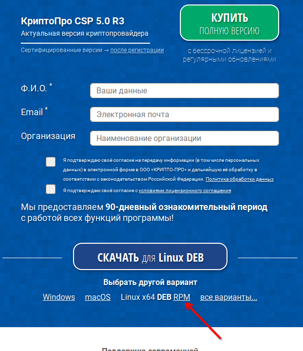
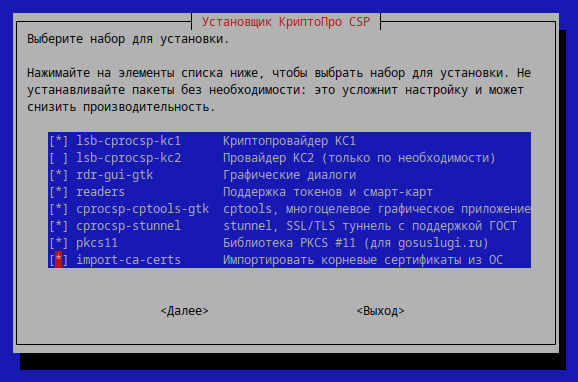
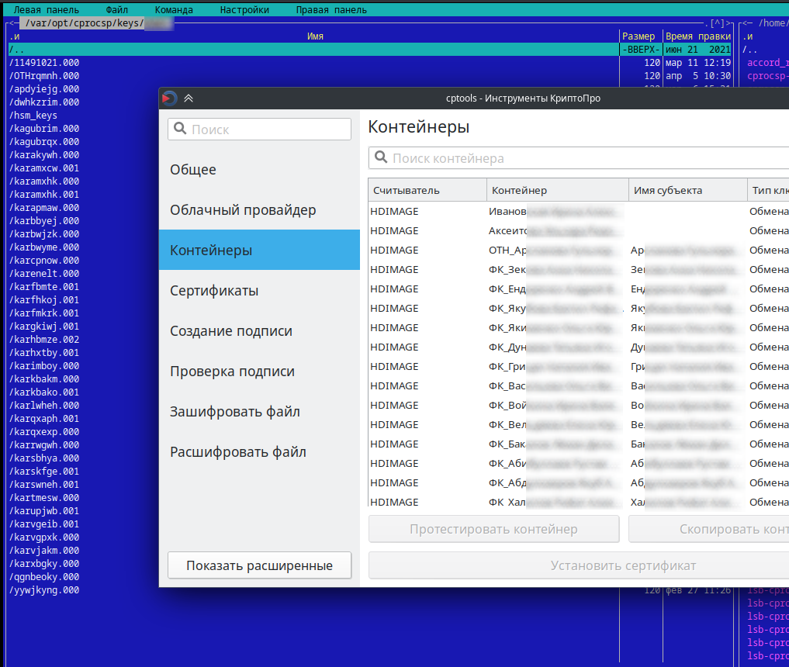
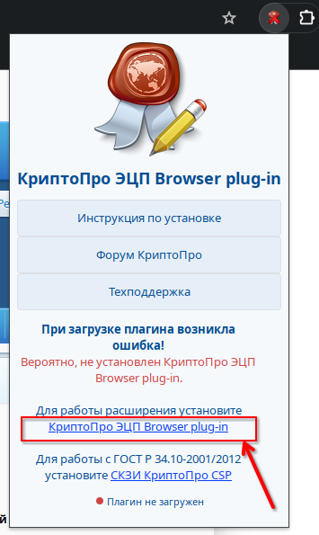
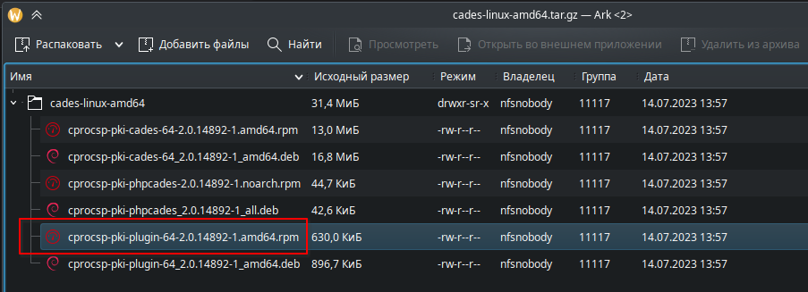
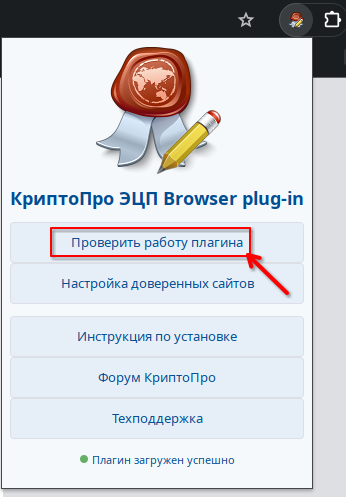
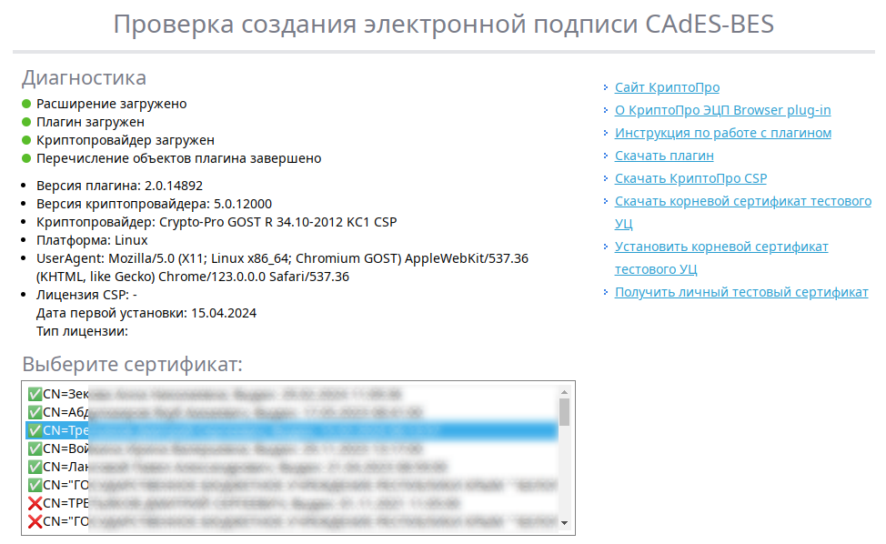

# КриптоПро CSP 5

КриптоПро CSP - программа для работы с электронными цифровыми подписями (ЭЦП)
</br></br></br>
**Установка**

Сначала установите пакет `cryptopro-preinstall`:

```
su -
apt-get install cryptopro-preinstall
```

Далее скачайте с официального сайта (https://cryptopro.ru/products/csp) дистрибутив программы, заполнив форму. Выбирайте `Linux x64 RPM` пакет.


</br></br>

После скачивания архива, полностью распакуйте его и через терминал под **root'ом** запустите графический инсталлятор командой `bash install_gui.sh` . На втором шаге можете выбрать нужные компоненты. Допустим, я выберу всё, кроме неиспользуемых мной средств защиты КС2.



По завершении установки появится приложение "Инструменты КриптоПро".
</br></br></br>

**Работа с носителями**

Если при установке была выбрана поддержка токенов и смарт-карт, то контейнеры, хранимые в защищенных носителях смогут определяться в "Инструменты КриптоПро".
Если же контейнеры хранятся на незащищенных носителях (на обычных "флешках") и "из коробки" такие контейнеры не стали определяться в "Инструменты КриптоПро" при подключении USB-носителя, то, как вариант, можно скопировать содержимое USB-носителя в директорию `var/opt/cprocsp/keys/username`, где `username` - используемое имя пользователя. Тогда "Инструменты КриптоПро" начнут видеть контейнеры в считывателе "Директория" (HDIMAGE)


</br></br></br>
**Установка личных сертификатов в КриптоПро CSP 5**

Теперь можно установить личные сертификаты.
1. Из контейнеров, в которые уже был установлен сертификат - выбрав в "Инструменты КриптоПро" во вкладке "Контейнеры" нужный из списка и нажав "Установить сертификат"
2. Из файла - выбрав в "Инструменты КриптоПро" вкладку "Сертификаты", нажав "Установить сертификаты"

</br></br></br>
**Установка корневых и промежуточных сертификатов в КриптоПро CSP 5**

Для работы на определенных площадках может потребоваться установка дополнительных корневых (root) и промежуточных (intermediate) сертификатов. После их скачивания, установить такие сертификаты можно будет средствами "Инструменты КриптоПро" в разделе Сертификаты/Установить сертификаты.

</br></br></br>
**Браузер**

Для работы с ЭЦП подойдут Яндекс.Браузер и Chromium GOST

</br></br></br>
**Плагин для браузера**

Для полноценной работы с ЭЦП в браузере также требуется наличие:
- установленного в браузере "**КриптоПро ЭЦП Browser plug-in**"
- установленного в системе пакета "**cprocsp-pki-plugin**"

Если в Chromium GOST по какой-то причине плагин "CryptoPro Extension for CAdES Browser Plug-in" не установился автоматически, то его потребуется установить в магазине приложений https://chrome.google.com/.

Далее, в случае отсутствия установленного пакета "**cprocsp-pki-plugin**", плагин предложит скачать архив:



В скачанном архиве нас будет интересовать пакет "**cprocsp-pki-plugin-...amd64.rpm**".



Распаковываем файл и под **root'ом** выполняем `apt-get install cprocsp-pki-plugin-64-2.0.14892-1.amd64.rpm`

`*` здесь команда приведена для примера. Версии пакетов и, соответственно, их номер постоянно обновляются.

Теперь возвращаемся в браузер и идем проверять работу плагина. Все должно работать




