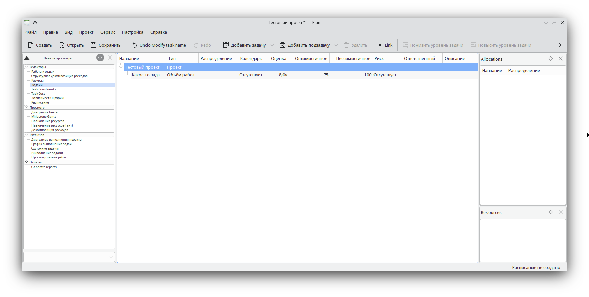

# Plan

Plan — приложение по управлению проектами, предназначено для работы c it-проектами.

Возможности:

- Множество режимов просмотра: диаграмма Ганта, режим просмотра ресурсов, режим просмотра счетов
- Использование стандартных структур: Структурная декомпозиция работ (СДР), иерархическая структура ресурсов (RBS), структура распределения затрат (CBS)
- Настраиваемый уровень детализации на диаграмме Ганта
- Поддержка итоговых задач и этапов
- Настраиваемые ограничения планирования

<!--@include: @apps/_parts/install/content-repo.md-->
