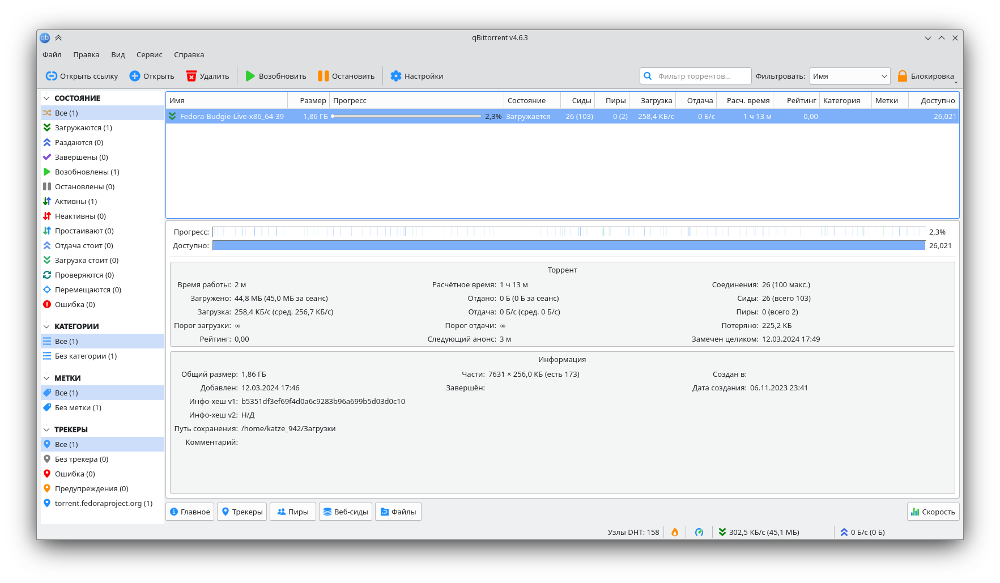

# qBittorrent

{{ $frontmatter.title }} — это бесплатный и открытый клиент BitTorrent, который позволяет пользователям загружать и скачивать файлы через протокол BitTorrent.



## Установка из репозитория 

**{{ $frontmatter.title }}** можно установить любым привычным и удобным способом:

<!--@include: /parts/install/software-repo.md-->

**Установка через терминал**

::: code-group

```shell[apt-get]
su -
apt-get update
apt-get install qbittorrent
```
```shell[epm]
epm -i qbittorrent
```
:::

## Установка с помощью Flatpak

При наличии пакета [Flatpak](/package-manager/flatpak/), можно установить **{{ $frontmatter.title }}** одной командой:
```shell
flatpak install flathub org.qbittorrent.qBittorrent
```

<!--@include: /parts/install/software-flatpak.md-->