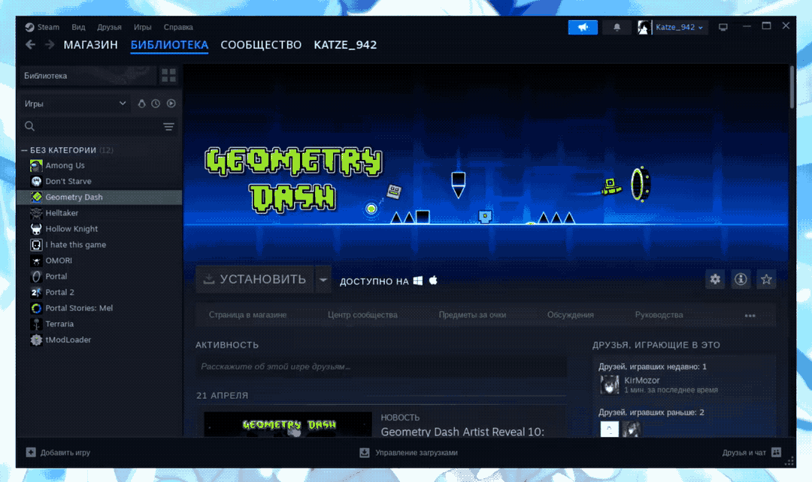
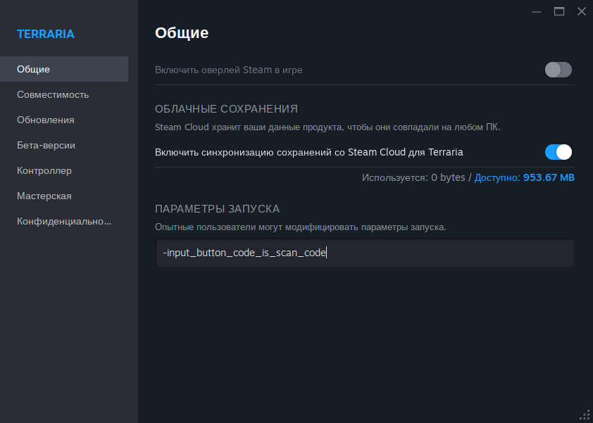
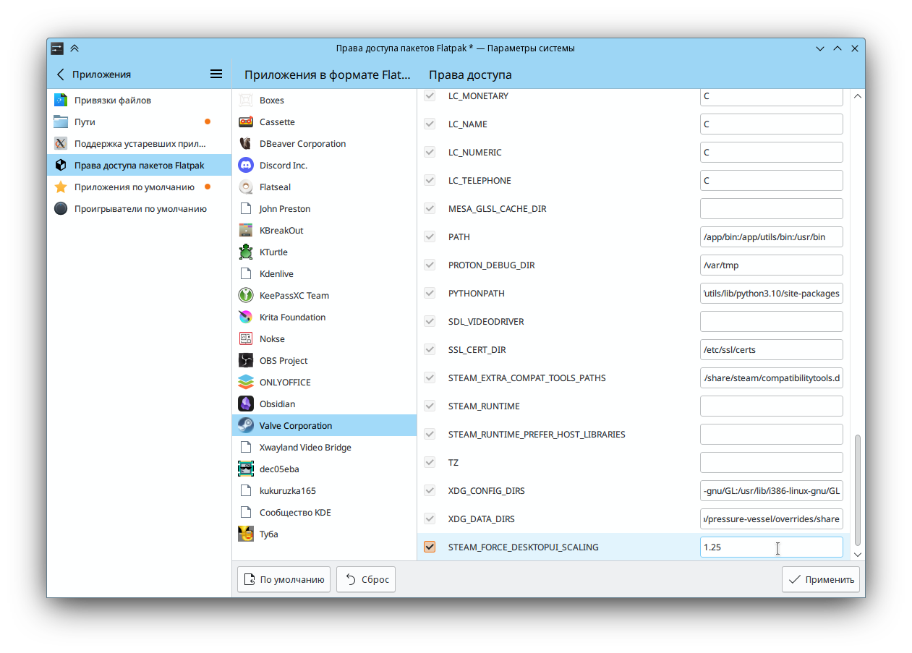

# Steam

Steam — крупнейшая в мире платформа от Valve для цифрового распространения игр с технической защитой авторских прав, функциями социальных сетей для игроков и потокового вещания.

:::info
Для корректной работы рекомендуется устанавливать Steam с помощью `epm play`
:::

<!--@include: @apps/.parts/install/content-repo.md-->
<!--@include: @apps/.parts/install/content-flatpak.md-->
<!--@include: @apps/.parts/install/content-epm-play.md-->

## Как поменять язык в Steam

Запустите клиент и найдите в верхней части приложения надпись «Steam». При нажатии на неё откроется контекстное меню, выберите пункт Settings. В настройках перейдите в раздел Interface и кликните на English, чтобы открыть меню языков. В выпадающем списке выберите «Русский» и нажмите OK.

После этого появится окно с информацией о том, что для применения изменений нужно перезапустить приложение. Нажмите Restart и после перезагрузки он должен запуститься на русском языке.


## Steam Play

Proton — интегрированный со Steam Play инструмент, стремящийся сделать запуск Windows-игр в Linux таким же простым, как нажатие кнопки «Играть» в Steam. Внутри него хранятся разные популярные инструменты вроде Wine и DXVK, которые игроку в противном случае пришлось бы устанавливать и поддерживать самостоятельно.

Запустите клиент и найдите в верхней части приложения надпись Steam. При нажатии на неё откроется контекстное меню, выберите пункт «Настройки». В настройках перейдите в раздел совместимость и выберите:

- Включить Steam Play, для поддерживаемых продуктов
- Включить Steam Play для других продуктов
- Включить другие игры с помощью `Proton 8.x.x`

Включить поддержку Steam Play возможно и для конкретной игры. В разделе **БИБЛИОТЕКА** в перечне с играми выберите из списка игру, вызовите контекстное меню правой кликом мышки и выберите пункт свойства. В окне настроек в разделе **Совместимость**, активируйте опции **Принудительно использовать выбранный инструмент совместимости Steam Play** и выберите нужную вам ветку **Proton**



## Проверить совместимость игр в Steam Play

[ProtonDB](https://www.protondb.com/) — база отчётов от игроков о совместимости игр на Linux и Steam Deck. Список постоянно растёт и растущий выбор предложений позволяет настраивать игры, пока Proton продолжает улучшаться. В дополнении к этому, вы можете изучить каталог доступных игр.

## Запуск Steam для графических устройств от AMD

Для запуска клиента Steam требуется установить дополнительные пакеты:

::: code-group

```shell[apt-get]
su -
apt-get update
apt-get install vulkan-amdgpu xorg-drv-amdgpu i586-xorg-drv-amdgpu
```

```shell[epm]
epm -i vulkan-amdgpu xorg-drv-amdgpu i586-xorg-drv-amdgpu
```

:::

## Запуск Steam для графических устройств от Intel

Для запуска клиента Steam требуется установить дополнительные пакеты:

::: code-group

```shell[apt-get]
su -
apt-get update
apt-get install i586-libGL i586-libGLU i586-xorg-dri-intel
```

```shell[epm]
epm -i i586-libGL i586-libGLU i586-xorg-dri-intel
```

:::

## Рекомендации и обходные решения

### Не работают клавиши управления в игре при нативном запуске (без Proton)

Проверьте что при запуске игры в вашей системе выбрана английская раскладка клавиатуры. Если это не так, то закройте игру, поменяйте раскладку на английскую и запустите игру заново.

Так-же можно добавить параметр запуска к игре, это должно решить проблему:

```shell
-input_button_code_is_scan_code
```



### Залипают клавиши (stuck down) в играх Steam Play (Proton)

Вы можете использовать `xset` утилиту, которая работает на X.org уровне в средах рабочего стола.

Отключить повторение с клавиатуры:

```shell
xset r off
```

:::info
Как правило, данная проблема связанна с ошибкой в библиотеке Ibus.

Данный метод работает как в Xorg, так и Wayland сессиях.
:::

Снова включить повтор с клавиатуры с теми же настройками задержки и скорости:

```shell
xset r on
```

### Зависание мышки при движении в играх

Данная проблема обусловлена подключением «Неизвестного монитора» в списке устройств у пользователей NVIDIA c проприетарными драйверами версии 535.xx. Временное решение описано на станице [NVIDIA](https://alt-gnome.wiki/nvidia.html#%C2%AB%D0%BD%D0%B5%D0%B8%D0%B7%D0%B2%D0%B5%D1%81%D1%82%D0%BD%D1%8B%D0%B8-%D0%BC%D0%BE%D0%BD%D0%B8%D1%82%D0%BE%D1%80%C2%BB-%D0%B2-%D0%BD%D0%B0%D1%81%D1%82%D1%80%D0%BE%D0%B8%D0%BA%D0%B0%D1%85-%D0%B4%D0%B8%D1%81%D0%BF%D0%BB%D0%B5%D0%B5%D0%B2-%D0%B2-%D1%81%D0%B5%D1%81%D1%81%D0%B8%D0%B8-wayland)

### Масштабирование интерфейса Steam для High DPI мониторов

**Steam <Badge type="tip" text="Flatpak" />**

Откройте Параметры системы KDE5, перейдите в «Приложения» => «Права доступа пакетов Flatpak». Найдите там Steam, откройте «Дополнительные права» и в категории «Переменные окружения» добавьте параметр `STEAM_FORCE_DESKTOPUI_SCALING`, к примеру, со значением коэффициента масштабирования `1.25`



Или через терминал:

```shell
flatpak override --user --env=STEAM_FORCE_DESKTOPUI_SCALING=1.25 com.valvesoftware.Steam
```
