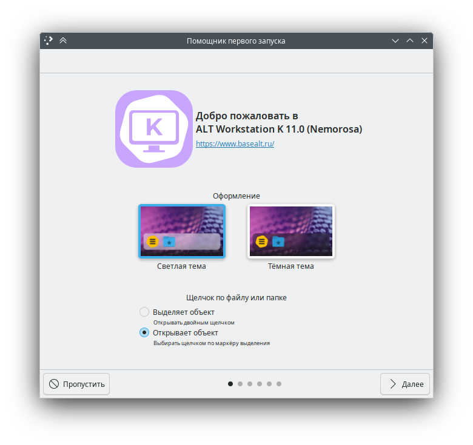

---
gallery:
  - type: slider
    items:
      - src: ./img/main.png
      - src: ./img/initial-setup.png
      - src: ./img/menu.png
      - type: slider

  - type: slider
    items:
      - src: ./img/installer-sliders.png
      - src: ./img/installer-selection-of-packages.png
      - type: slider
---

# Альт Рабочая станция K 11

<GalleryALT id=0 />

Альт Рабочая станция К — дистрибутив семейства ОС «Альт», разрабатываемый и поддерживаемый Базальт СПО.

В основе системы — графическое окружение KDE Plasma 6.3.4 и KDE Frameworks 6.12.0. Обновлённые драйверы NVIDIA (версия 570.133.07) в сочетании с современными компонентами KDE Plasma обеспечивают стабильную работу в Wayland сеансе.

::: info 💡 Что такое Wayland?
**Wayland** — новая технология отрисовки графического интерфейса, призванная заменить устаревший X11. В Альт Рабочей Станции К 11 сеанс Wayland активирован по умолчанию, что повышает безопасность и производительность системы. При необходимости пользователь может переключиться на X11 перед входом в систему.
:::

::: warning ⚠️ Не игнорируйте Wayland
Wayland обеспечивает полноценную поддержку жестов и мультитача для сенсорных устройств, недоступную в Xorg. Он также реализует технологию HDR, повышает безопасность за счёт изоляции приложений — они не могут перехватывать данные из других окон и многое другое.

Сеанс KWin X11 не тестируется разработчиками KDE, его поддержка сильно ограничена и новый функционал внедряться не будет. По возможности используйте Wayland, если ваше оборудование совместимо. Подробнее о Wayland можно прочитать [здесь](https://kde.ru/kb/wayland/).
:::

## Визуальные улучшения

Помимо обновления KDE окружения, в 11-й версии дистрибутива проведена работа над обновлением визуального стиля: модернизированы установщик, слайд-шоу и добавлены новые фирменные обои.

<GalleryALT id=1 />

## Новые приложения и инструменты

### Помощник первого запуска

Интерактивный гид, который знакомит пользователя с интерфейсом KDE Plasma и базовыми возможностями системы.

### Сургуч

Программа для создания и проверки электронных подписей в PDF-документах. Совместима с популярным российским криптопровайдером КриптоПро CSP.

### Копидел

Утилита для изготовления копий операционых систем в формате ISO с последующей возможностью их тиражирования через сеть или физические носители. 

### GameMode

Инструмент для оптимизации системных параметров под конкретные игры без изменения глобальных настроек. Позволяет повысить производительность игр.

## Технические улучшения

- **FFmpeg 7.1** — добавлена поддержка стандарта сжатия VVC (H.266), который сокращает размер видеофайлов в 2 раза без потери качества. Ускорение обработки видео через Vulkan и исправление цветовых диапазонов.
- **Altboot** — замена устаревшей подсистемы propagator. Ускоряет процесс загрузки и повышает надёжность установки на сложные конфигурации (RAID10 + LVM + LUKS2).
- **Поддержка LUKS2** — реализована возможность установки системы на зашифрованные разделы с использованием актуального стандарта шифрования.
- **Новый установщик на базе LiveCD** — все необходимые драйверы (включая Wi-Fi и NVIDIA) предустановлены, что упрощает процесс инсталляции.
- **PipeWire вместо PulseAudio** — современная звуковая подсистема обеспечивает стабильную работу с микрофонами, Bluetooth-устройствами и приложениями для видеоконференций.
- **UID пользователя** — идентификатор первого пользователя изменён с 500 на 1000 для соответствия современным стандартам.
- **LTO-оптимизация** — большинство пакетов собраны с использованием Link Time Optimization, что повышает скорость работы приложений.

## Поддержка оборудования и безопасность

- **Новый установщик на базе LiveCD** — все необходимые драйверы (включая Wi-Fi и NVIDIA) предустановлены.
- **Secure Boot** — улучшена поддержка безопасной загрузки для совместной установки с Windows.
- **Fortinet SSLVPN** — модуль для защиты данных в публичных сетях Wi-Fi через шифрование по протоколу SSL/TLS.
- **Поддержка шлемов VR** — реализована работа с устройствами виртуальной реальности, включая беспроводные решения.
- **Режим администратора Dolphin** — модуль `kio-admin` позволяет редактировать системные и конфигурационные файлы через файловый менеджер Dolphin с правами администратора в графическом интерфейсе.

## Другие важные изменения

- Изменение нейминга ядер, с `std-def/un-def` на `6.12`;
- Изменение директорий в файловой системе `/bin` -> `/usr/bin`, `/sbin` -> `/usr/sbin`;
- Полностью новая документация для ALT Workstation K 11.0 доступна в разделе «О системе» или в `/usr/share/doc/alt-kworkstation/index.html`;

## Скачать «Рабочую станцию K» со средой рабочего стола KDE Plasma

Условия лицензирования указаны на сайте «Базальт СПО» на [странице продукта](https://www.basealt.ru/alt-workstation-k-11).

### Установочный образ x86_64

[ALT Workstation K <Badge type="tip" text="iso" />](https://download.basealt.ru/pub/distributions/ALTLinux/p11/images/kworkstation/alt-kworkstation-11-install-x86_64.iso)

### Живой образ x86_64 (LiveCD) для запуска без установки 

[ALT Workstation K<Badge type="tip" text="iso" />](https://download.basealt.ru/pub/distributions/ALTLinux/p11/images/kworkstation/alt-kworkstation-11-live-x86_64.iso)

### Контрольные суммы

[GOST12SUM](https://download.basealt.ru/pub/distributions/ALTLinux/p11/images/kworkstation/GOST12SUM)

[MD5SUM](https://download.basealt.ru/pub/distributions/ALTLinux/p11/images/kworkstation/MD5SUM)

[SHA1SUM](https://download.basealt.ru/pub/distributions/ALTLinux/p11/images/kworkstation/SHA1SUM)

## Хронология

 

::: timeline Alpha <Badge text="20.11.2024" />
[Пост ALT KDE](https://t.me/alt_kde/752) | [Рассылка Devel](https://lore.altlinux.org/devel/346422768.VP2IySKdXl@zerg.malta.altlinux.ru/)
:::

::: timeline Alpha 20241226 <Badge text="27.12.2024" />
[Пост ALT KDE](https://t.me/alt_kde/752) | [Рассылка Devel](https://lore.altlinux.org/devel/3191329.SqRfDK25sQ@zerg.malta.altlinux.ru/)
:::

::: timeline Beta 20250210 <Badge text="11.02.2025" />
[Рассылка Devel](https://lore.altlinux.org/devel/2776761.mvXUDI8C0e@zerg.malta.altlinux.ru/)
:::

::: timeline Beta 2025-02-21 <Badge text="21.02.2025" />
[Пост ALT KDE](https://t.me/alt_kde/798) | [Рассылка Devel](https://lore.altlinux.org/devel/5932287.DvuYhMxLoT@zerg.malta.altlinux.ru/)
:::

::: timeline RC 20250310 <Badge text="10.03.2025" />
[Пост KDE](https://t.me/alt_kde/823) | [Рассылка Devel](https://lore.altlinux.org/devel/3887352.kQq0lBPeGt@zerg.malta.altlinux.ru/)
:::

::: timeline RC 20250326 <Badge text="27.03.2025" />
[Пост KDE](https://t.me/alt_kde/844) | [Рассылка Devel](https://lore.altlinux.org/devel/2792452.mvXUDI8C0e@zerg.malta.altlinux.ru/)
:::

::: timeline RC 20250414 <Badge text="25.04.2025" />
[Пост KDE](https://t.me/alt_kde/859) | [Рассылка Devel](https://lore.altlinux.org/devel/7792326.EvYhyI6sBW@zerg.malta.altlinux.ru/)
:::

::: timeline Релиз 11.0 <Badge text="07.05.2025" />
:::
