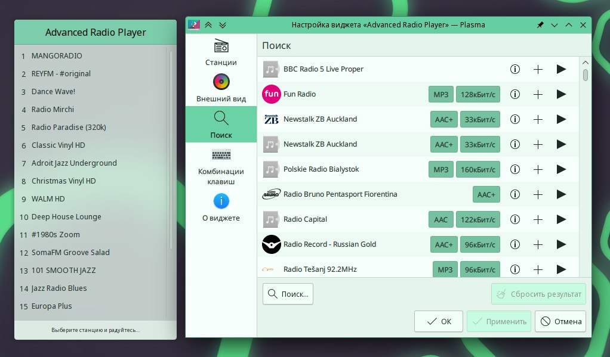

---
aggregation:
  extension:
    type: widget
    id: 2136933
appstream:
  name: Advanced Radio Player
  summary: Компактный радиоплеер с редактируемым списком станций и обложками треков.
  developer:
    name: Yuri Saurov
    nickname: saurov
  url:
    homepage: https://invent.kde.org/saurov/arp
    bugtracker: https://invent.kde.org/saurov/arp/-/issues
---

# Advanced Radio Player

Виджет-радиоплеер для KDE Plasma с возможностью добавлять и редактировать радиостанции, отображать обложки и дополнительную метаинформацию трека (если доступно). Поддерживает размещение и на панели, и на рабочем столе.

## Возможности

- Редактирование списка станций прямо в настройках виджета
- Отображение обложки и сведений о треке (при наличии в потоке)
- Состояние воспроизведения с индикацией на иконке
- Управление колёсиком мыши по иконке для регулировки громкости

<!--@include: @extensions/.parts/show-install-steps.md-->
