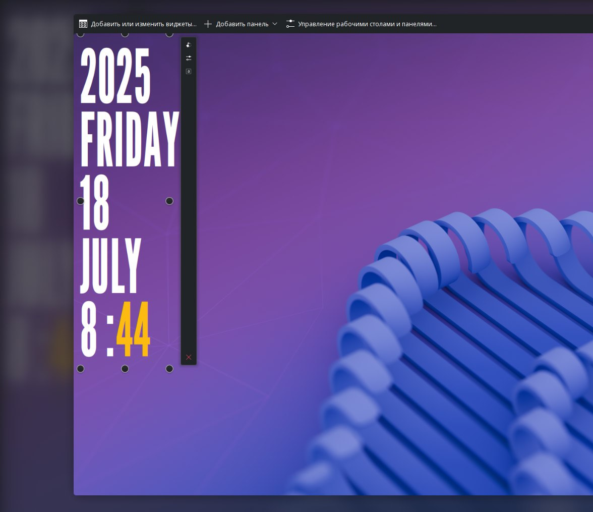

---
aggregation:
  extension:
    type: widget
    id: 2136288
appstream:
  name: Big Clock
  summary: Виджет больших часов с датой для KDE Plasma.
  developer:
    name: Zayron
    nickname: zayronxio
  url:
    homepage: https://github.com/zayronxio/
---

# Big Clock

Виджет больших часов с адаптивным размером шрифта для KDE Plasma. Размер текста автоматически подстраивается под габариты виджета, обеспечивая оптимальную читаемость независимо от выбранного размещения на рабочем столе или панели.

Виджет отличается минималистичным дизайном и гибкими настройками внешнего вида. Идеально подходит для создания информационных панелей и рабочих столов с акцентом на отображение времени.

## Основные возможности

Виджет предоставляет следующие параметры настройки:

- Автоматическая адаптация размера шрифта под размер виджета
- Выбор выравнивания текста — по левому или правому краю
- Настройка цвета элементов интерфейса
- Отображение текущей даты вместе со временем

<!--@include: @extensions/.parts/show-install-steps.md-->
