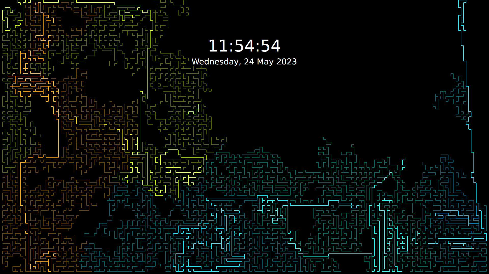

---
aggregation:
  extension:
    type: wallpaper
    id: 2138971
appstream:
  name: City Grow
  summary: Плагин анимированных обоев с простыми настройками в стиле «Растущий город»
  developer:
    name: HobbyBlobby
    nickname: HobbyBlobby
  url:
    homepage: https://github.com/HobbyBlobby/PlasmaWallpaper_CityGrow
    bugtracker: https://github.com/HobbyBlobby/PlasmaWallpaper_CityGrow/issues
---

# City Grow

Простые анимированные обои для KDE Plasma, создающие эффект «растущего города». Плагин имеет базовые параметры и может быть установлен как на рабочий стол, так и на экран блокировки.

## Особенности

- Лёгкая анимация с невысокой нагрузкой на систему
- Параметры скорости/детализации в настройках плагина
- Поддержка установки на экран блокировки

## Известная проблема

::: warning Настройки применяются не сразу
Параметры плагина могут применяться с задержкой. Переключите тип обоев на другой и верните обратно, чтобы увидеть изменения.
:::

<!--@include: @extensions/.parts/show-install-steps.md-->
