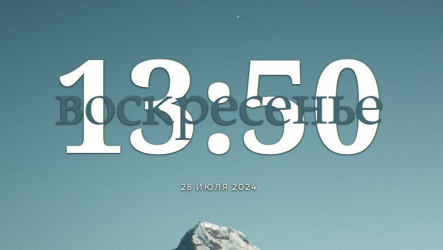

---
aggregation:
  extension:
    type: widget
    id: 2147871
appstream:
  name: Clear Clock
  summary: Минималистичный виджет даты и времени с настраиваемой типографикой.
  developer:
    name: qewer
    nickname: qewer33
  url:
    homepage: https://github.com/qewer33/ClearClock
    bugtracker: https://github.com/qewer33/ClearClock/issues
---

# Clear Clock

Лёгкий и настраиваемый виджет даты и времени для KDE Plasma. Позволяет менять цвета текста, шрифт, размеры и интервалы, подстраиваясь под ваши обои и общую тему рабочего стола.

По умолчанию встроенный шрифт может не поддерживать кириллицу, поэтому для корректного отображения русских названий дней и месяцев выберите альтернативный шрифт в настройках виджета.

## Основные возможности

- Настройка шрифтов, размеров и межстрочных интервалов
- Выбор цвета текста и акцентных элементов
- Гибкая компоновка даты и времени

<!--@include: @extensions/.parts/show-install-steps.md-->
