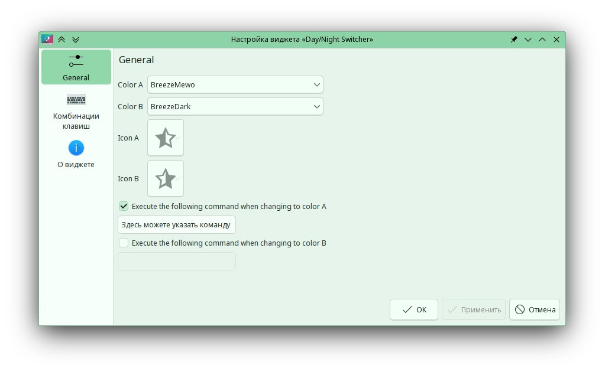

---
aggregation:
  extension:
    type: widget
    id: 1804745
appstream:
  name: Day/Night Switcher
  summary: Виджет для быстрого переключения между светлой и тёмной цветовой схемой
  developer:
    name: Heqro
    nickname: heqro
  url:
    homepage: https://github.com/heqro/colorschemeswapper-plasmoid
    bugtracker: https://github.com/heqro/colorschemeswapper-plasmoid/issues
---

# Day/Night Switcher

Виджет для удобного переключения между светлой и тёмной цветовой схемой рабочего стола. Позволяет быстро менять оформление в зависимости от времени суток или настроения без необходимости заходить в настройки системы.

Особенностью является возможность задания пользовательских команд, которые будут выполняться при переключении на ту или иную тему, что расширяет функциональность для продвинутых пользователей.

## Основные возможности

- Переключение между светлой и тёмной цветовой схемой одним нажатием
- Настройка цветовых схем для каждого режима в параметрах виджета
- Возможность выполнения пользовательских команд при смене темы
- Лаконичный и минималистичный дизайн
- Обновление и получение состояния темы в реальном времени

<!--@include: @extensions/.parts/show-install-steps.md-->
