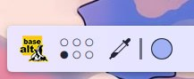

---
aggregation:
  extension:
    type: widget
    id: 2131462
appstream:
  name: Desktop Indicator
  summary: Минималистичный виджет для отображения индикатора рабочих столов.
  developer:
    name: Dhruv Sharma
    nickname: dhruv8sh
  url:
    homepage: https://github.com/dhruv8sh/plasma6-desktop-indicator
    bugtracker: https://github.com/dhruv8sh/plasma6-desktop-indicator/issues
---

# Desktop Indicator

Минималистичный виджет для KDE Plasma, который отображает индикатор текущих рабочих столов. Виджет отличается простотой и лаконичным дизайном, позволяя пользователям точно настроить визуализацию под собственные предпочтения.

Идеально подходит тем, кто хочет иметь чистый и функциональный способ отображения рабочих столов на панели без лишних элементов.

## Основные возможности

- Отображение текущего количества рабочих столов
- Подсветка активного рабочего стола
- Простой и понятный интерфейс без избыточных элементов
- Возможность настройки цвета и размера индикаторов
- Поддержка динамического обновления при изменении рабочих столов

<!--@include: @extensions/.parts/show-install-steps.md-->
