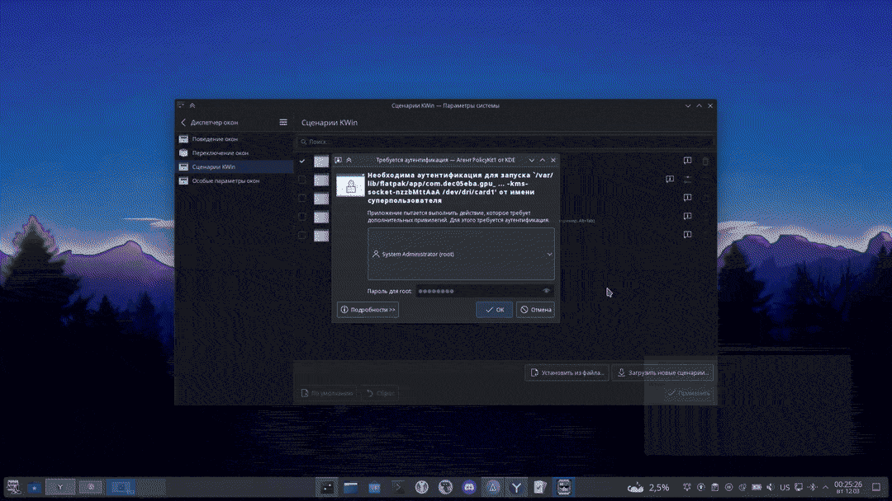

---
aggregation:
  extension:
    type: script
    id: 1312691
appstream:
  name: Dynamic Workspaces
  summary: Динамические виртуальные рабочие столы в стиле GNOME для KWin
  developer:
    name: maurges
    nickname: maurges
  url:
    homepage: https://github.com/maurges/dynamic_workspaces
    bugtracker: https://github.com/maurges/dynamic_workspaces/issues
---

# Dynamic Workspaces

Сценарий KWin, добавляющий «динамические» рабочие столы: всегда держит пустой стол справа, автоматически создаёт новый при переносе окна на последний и удаляет пустые столы, когда они не нужны. Поведение максимально близко к концепции рабочих столов GNOME.

## Особенности

- Всегда один пустой стол справа; новый создаётся при переносе окна на последний
- Удаление пустых рабочих столов при освобождении
- Горизонтальная модель слева направо (без сетки)
- Совместимость с Plasma 5 и Plasma 6

<!--@include: @extensions/.parts/show-install-steps.md-->
