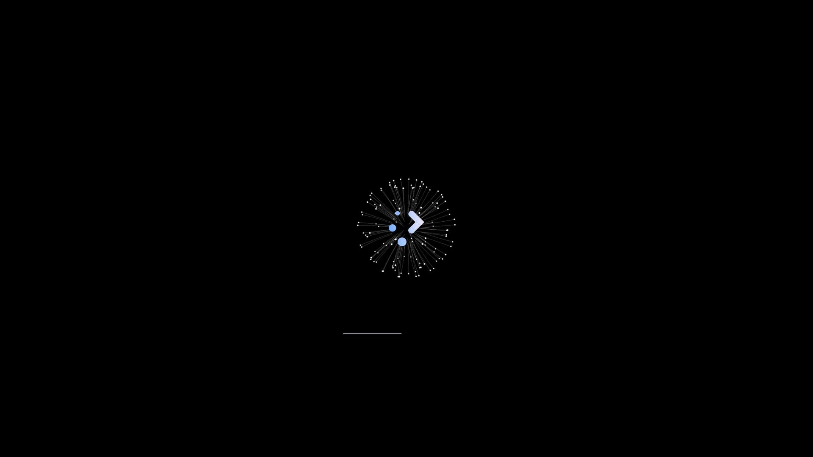

---
aggregation:
  extension:
    type: splash
    id: 2144609
appstream:
  name: Flight-Splash
  summary: Заставка Plasma с плавной анимацией из набора Flight-Plasma-Themes.
  developer:
    name: L4ki
    nickname: L4ki
  url:
    homepage: https://github.com/L4ki/Flight-Plasma-Themes
    bugtracker: https://github.com/L4ki/Flight-Plasma-Themes/issues
---

# Flight-Splash

Анимированная заставка для KDE Plasma из набора Flight-Plasma-Themes. Добавляет аккуратную плавную анимацию при входе в систему, делая ожидание загрузки рабочего стола более приятным.

## Особенности

- Плавная анимация запуска рабочего стола
- Стилистическая согласованность с другими элементами Flight‑темы

<!--@include: @extensions/.parts/show-install-steps.md-->
