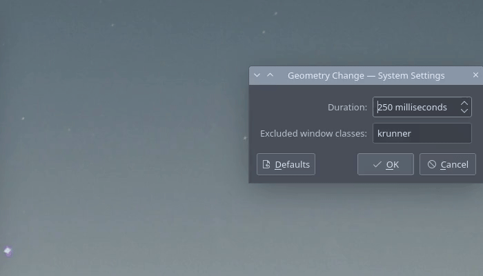

---
aggregation:
  extension:
    type: effect
    id: 2136283
appstream:
  name: Geometry Change
  summary: Плавная анимация изменения размеров и положения окон в KWin.
  developer:
    name: Peter Fajdiga
    nickname: peterfajdiga
  url:
    homepage: https://github.com/peterfajdiga/kwin4_effect_geometry_change
    bugtracker: https://github.com/peterfajdiga/kwin4_effect_geometry_change/issues
---

# Geometry Change

Эффект KWin, добавляющий плавные анимации при изменении геометрии окон: изменение размеров, перемещение, программная трансформация скриптами или правилами окон. Длительность эффекта можно подстроить под свой рабочий темп.

## Особенности

- Анимация изменения размеров и/или положения окна вместо резких прыжков
- Работает и для действий, инициированных приложениями или сценариями (скриптами)
- Настраиваемые длительность и ощущение плавности через параметры эффекта

<!--@include: @extensions/.parts/show-install-steps.md-->
