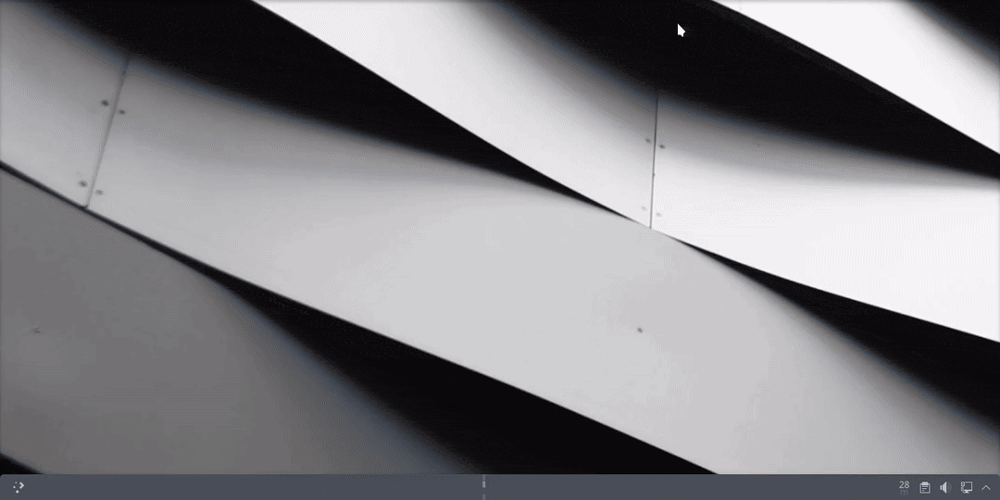

---
aggregation:
  extension:
    type: script
    id: 2138856
appstream:
  name: Karousel
  summary: Прокручиваемый тайлинг-менеджер окон для KWin.
  developer:
    name: Peter Fajdiga
    nickname: peterfajdiga
  url:
    homepage: https://github.com/peterfajdiga/karousel
    bugtracker: https://github.com/peterfajdiga/karousel/issues
---

# Karousel

Прокручиваемый тайлинг-менеджер окон для KWin, вдохновлённый PaperWM и Niri. В отличие от традиционных тайлинг-менеджеров, Karousel не максимизирует ширину окон автоматически — вместо этого контроль над шириной остаётся у пользователя. Когда место на экране заканчивается, окна можно прокручивать горизонтально.

Сценарий особенно хорош для ультрашироких мониторов, где стандартный тайлинг может создавать слишком широкие окна. Окна автоматически центрируются, когда это возможно, обеспечивая комфортную работу с несколькими приложениями одновременно.

## Основные возможности

### Прокручиваемый тайлинг

- Автоматическая организация окон в колонки с возможностью горизонтальной прокрутки
- Ширина окон остаётся под контролем пользователя
- Автоматическое центрирование окон при достаточном пространстве
- Режим стекинга для колонок (только активное окно видимо)

### Управление колонками

- Перемещение колонок влево/вправо
- Изменение ширины колонок через горячие клавиши
- Циклическое переключение между предустановленными ширинами
- Выравнивание ширины всех видимых колонок
- Перемещение колонок между виртуальными рабочими столами

### Навигация и фокус

- Перемещение фокуса между окнами в сетке
- Быстрый переход к началу/концу сетки
- Прокрутка на одну колонку влево/вправо
- Центрирование сфокусированного окна на экране

### Управление окнами

- Переключение режима плавающего окна
- Перемещение окон внутри и между колонками
- Перемещение окон вверх/вниз внутри колонки
- Быстрое перемещение окон в определённые колонки по номеру

## Горячие клавиши

::: tip Настройка сочетаний
Все горячие клавиши можно изменить в разделе «Параметры системы» → «Клавиатура» → «Комбинации клавиш». Некоторые комбинации по умолчанию конфликтуют со стандартными сочетаниями KDE и требуют ручного переназначения.
:::

### Основные действия

|      Комбинация      |             Описание             |
| :------------------: | :------------------------------: |
| [[Meta]] + [[Space]] | Переключить плавающий режим окна |
|   [[Meta]] + [[A]]   |     Переместить фокус влево      |
|   [[Meta]] + [[D]]   |     Переместить фокус вправо     |
|   [[Meta]] + [[W]]   |     Переместить фокус вверх      |
|   [[Meta]] + [[S]]   |      Переместить фокус вниз      |
| [[Meta]] + [[Home]]  |    Переместить фокус в начало    |
|  [[Meta]] + [[End]]  |    Переместить фокус в конец     |

### Перемещение окон

|           Комбинация            |                 Описание                  |
| :-----------------------------: | :---------------------------------------: |
|  [[Meta]] + [[Shift]] + [[A]]   | Переместить окно влево (между колонками)  |
|  [[Meta]] + [[Shift]] + [[D]]   | Переместить окно вправо (между колонками) |
|  [[Meta]] + [[Shift]] + [[W]]   |          Переместить окно вверх           |
|  [[Meta]] + [[Shift]] + [[S]]   |           Переместить окно вниз           |
| [[Meta]] + [[Shift]] + [[Home]] |         Переместить окно в начало         |
| [[Meta]] + [[Shift]] + [[End]]  |         Переместить окно в конец          |

### Управление колонками

|                 Комбинация                 |                    Описание                     |
| :----------------------------------------: | :---------------------------------------------: |
|              [[Meta]] + [[X]]              |      Переключить стекинг-режим для колонки      |
|  [[Meta]] + [[Ctrl]] + [[Shift]] + [[A]]   |            Переместить колонку влево            |
|  [[Meta]] + [[Ctrl]] + [[Shift]] + [[D]]   |           Переместить колонку вправо            |
| [[Meta]] + [[Ctrl]] + [[Shift]] + [[Home]] |          Переместить колонку в начало           |
| [[Meta]] + [[Ctrl]] + [[Shift]] + [[End]]  |           Переместить колонку в конец           |
|        [[Meta]] + [[Ctrl]] + [[+]]         |            Увеличить ширину колонки             |
|        [[Meta]] + [[Ctrl]] + [[-]]         |            Уменьшить ширину колонки             |
|              [[Meta]] + [[R]]              |   Циклически изменить ширину (предустановки)    |
|        [[Meta]] + [[Shift]] + [[R]]        | Циклически изменить ширину (в обратном порядке) |
|        [[Meta]] + [[Ctrl]] + [[X]]         |        Выровнять ширину видимых колонок         |

### Прокрутка

|           Комбинация            |             Описание              |
| :-----------------------------: | :-------------------------------: |
|   [[Meta]] + [[Alt]] + [[A]]    | Прокрутить на одну колонку влево  |
|   [[Meta]] + [[Alt]] + [[D]]    | Прокрутить на одну колонку вправо |
|  [[Meta]] + [[Alt]] + [[PgUp]]  |         Прокрутить влево          |
| [[Meta]] + [[Alt]] + [[PgDown]] |         Прокрутить вправо         |
|  [[Meta]] + [[Alt]] + [[Home]]  |        Прокрутить в начало        |
|  [[Meta]] + [[Alt]] + [[End]]   |        Прокрутить в конец         |
| [[Meta]] + [[Alt]] + [[Return]] | Центрировать сфокусированное окно |

<!--@include: @extensions/.parts/show-install-steps.md-->

## Рекомендации по использованию

::: tip Плавные анимации
Для плавных анимаций перемещения и изменения размера окон установите эффект «Geometry Change». Это значительно улучшит визуальное восприятие работы сценария.
:::

::: tip Фокус следует за мышью
Karousel особенно удобен в связке с настройкой «Фокус следует за мышью». Включите её в разделе «Параметры системы» → «Управление окнами» → «Фокус окон» для более естественного взаимодействия с окнами.
:::

::: warning Перезапуск после настройки
После изменения настроек сценария необходимо отключить его и включить заново для применения изменений. Это можно сделать в разделе «Сценарии KWin».
:::

## Известные ограничения

Сценарий имеет следующие ограничения:

- Не поддерживает несколько экранов (мультимониторные конфигурации)
- Не работает с окнами, размещёнными на всех рабочих столах
- Не поддерживает окна на нескольких активностях одновременно
