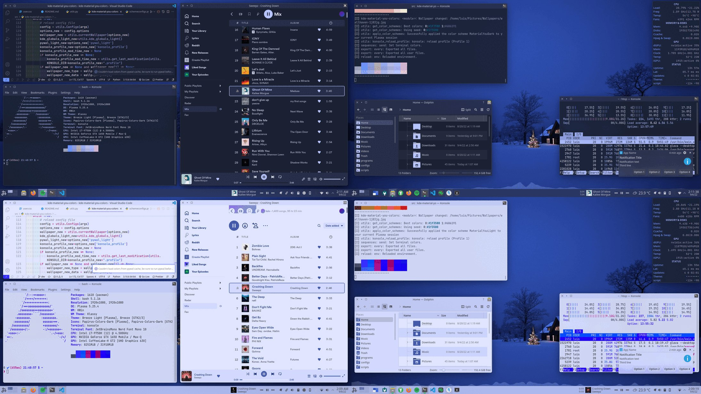

---
aggregation:
  extension:
    type: widget
    id: 2136963
appstream:
  name: KDE Material You Colors
  summary: Автоматический генератор цветовых схем на основе обоев с использованием Material You.
  developer:
    name: Luis Bocanegra
    nickname: luisbocanegra
  url:
    homepage: https://github.com/luisbocanegra/kde-material-you-colors
    bugtracker: https://github.com/luisbocanegra/kde-material-you-colors/issues
---

# KDE Material You Colors

Инструмент для автоматической генерации цветовых схем на основе текущих обоев рабочего стола. Использует дизайн-концепцию Material You от Google, адаптированную для экосистемы KDE, обеспечивая создание гармоничного и динамичного оформления.

Проект отличается от встроенной в Plasma функции извлечения цветов расширенными возможностями кастомизации, включая одновременное создание светлых и тёмных тем, интеграцию с терминалами и поддержку pywal для тематизации сторонних приложений.



## Основные возможности

### Интеграция с Plasma

- Автоматическое обновление цветовой схемы при смене обоев
- Поддержка различных плагинов обоев (статичные изображения, слайд-шоу, анимированные обои)
- Одновременное создание светлых и тёмных цветовых схем с соответствующими наборами иконок
- Совместимость с планировщиками тем для автоматического переключения между режимами
- Поддержка тёмных вариантов обоев в Plasma
- Автозапуск при входе в систему

### Настройка оконных декораций

- Контроль прозрачности заголовков для оформлений **Klassy** и **SierraBreezeEnhanced**
- Возможность затемнения заголовков для лучшего соответствия определённым приложениям
- Управление прозрачностью панели инструментов для стиля приложений **Lightly**
- Тонирование кнопок оконной декорации **SierraBreeze**
- Тонирование контура оконной декорации **Klassy**

### Поддержка приложений

- Создание и применение цветовых схем для **Konsole** с контролем прозрачности и размытия
- Базовая поддержка подсветки синтаксиса через **KSyntaxHighlighting** (Kate, KWrite, KDevelop)
- Интеграция с **pywal** для тематизации сторонних программ цветами Material You

### Варианты цветовых схем

Доступен выбор из нескольких вариантов палитры Material You:

- **Vibrant** — яркие и насыщенные цвета
- **Monochrome** — монохромная палитра
- **Neutral** — нейтральные оттенки
- **Expressive** — выразительные сочетания
- **Fidelity** — точное следование исходным цветам

### Дополнительные опции

- Выбор альтернативной цветовой палитры, если обои предоставляют несколько вариантов
- Генерация схем на основе пользовательского цвета
- Настройка насыщенности и яркости темы
- Пользовательский список цветов для Konsole и pywal
- Независимое управление светлыми и тёмными схемами для Plasma и pywal/Konsole
- Выполнение пользовательских скриптов при изменении обоев или настроек
- Режим паузы для остановки автоматической генерации тем

## Установка

Установка состоит из трёх этапов: установка зависимостей, установка бэкенда и установка виджета.

### Установка зависимостей

::: code-group

```shell[apt-get]
su -
apt-get update
apt-get install python3-module-pipx gcc python3-module-dbus glib2-devel libdbus-devel python3-devel
```

```shell[epm]
epm -i python3-module-pipx gcc python3-module-dbus glib2-devel libdbus-devel python3-devel
```

:::

### Установка бэкенда

::: tabs

== Plasma 6

```shell
pipx install kde-material-you-colors
pipx inject kde-material-you-colors pywal16

# для обновления до новой версии
pipx upgrade kde-material-you-colors
```

== Plasma 5

Если вы используете устаревшую версию Plasma 5, установите версию 1.7.1:

```shell
pipx install kde-material-you-colors==1.7.1
pipx inject kde-material-you-colors pywal
```

:::

<!--@include: @extensions/.parts/show-install-steps.md-->

## Интеграция с браузерами

Для применения цветовой схемы к Firefox доступны следующие варианты:

- Использование расширения «Pywalfox» (https://github.com/Frewacom/pywalfox) для автоматической синхронизации
- Ручная настройка через «Colors» → «Manage Colors» → «Use System Colors» с параметром «Override» → «Always»
- Для тёмных тем может потребоваться настройка GTK-темы, например «Goldy-Dark-GTK»

## Известные ограничения

::: warning Обратите внимание

- Плагин слайд-шоу обоев может вызывать проблемы из-за ограничений API скриптов
- Виджеты и папки на рабочем столе могут попадать на скриншоты и влиять на генерацию цветов
- Существует визуальный баг с потерей выделения выбранного варианта цветовой схемы (функциональность сохраняется)
- Ограниченная поддержка «KSyntaxHighlighting» — изменяется только часть цветов в редакторах кода
:::
