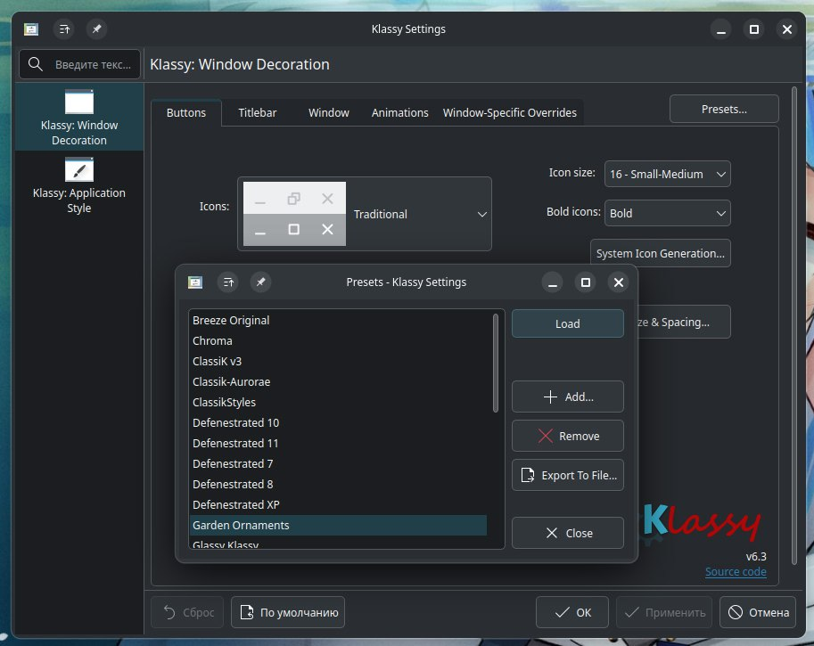

---
aggregation:
  extension:
    type: widget
    id: 1877255
  sisyphus: kde6-plasma-klassy
appstream:
  name: Klassy
  summary: Настраиваемый плагин оформления окон, стиля приложений и глобальной темы
  developer:
    name: Paul A McAuley
    nickname: paulmcauley
  url:
    homepage: https://github.com/paulmcauley/klassy
    bugtracker: https://github.com/paulmcauley/klassy/issues
---

# Klassy

Высоко настраиваемый плагин оформления окон, стиля приложений и глобальной темы. Предоставляет расширенный контроль над внешним видом элементов интерфейса, включая заголовки окон, элементы управления и общую стилистику приложений.

Плагин базируется на теме Breeze, расширяя её возможности настройки и добавляя множество готовых предустановок, имитирующих популярные операционные системы и дизайнерские концепции.

## Основные возможности

Klassy предоставляет комплексную настройку внешнего вида рабочего окружения:

- Настройка цвета и прозрачности заголовков окон
- Регулировка радиуса закругления углов окон
- Управление контурами и границами окон
- Настройка поведения элементов управления окнами
- Кастомизация кнопок заголовка и их расположения
- Регулировка теней окон

### Готовые предустановки

Плагин включает набор предварительно настроенных тем:

- **Opal** — новая тема по умолчанию с яркой цветовой палитрой и чётким различием активных и неактивных окон
- **Kisweet** — базовая предустановка с фирменным набором иконок
- **Breeze** — классический стиль оформления
- **Windows** — стилизация под интерфейс Windows
- **macOS** — имитация дизайна операционной системы Apple
- **Glassy Klassy** — вариант с эффектом полупрозрачности

<!--@include: @extensions/.parts/install-from-repository.md-->

## Применение темы

После установки необходимо активировать Klassy в параметрах оформления. Процесс похож на применение темы Kvantum:

1. Откройте параметры системы
2. Перейдите в **Цвета и оформление** → **Оформление рабочего стола**
3. Примените тему **Klassy**
4. Перейдите в **Цвета и оформление** → **Оформление окон**
5. Примените тему **Klassy**

После применения откройте приложение **Klassy Settings** для доступа к расширенным настройкам. В разделе **Presets** доступен выбор готовых предустановок оформления.
