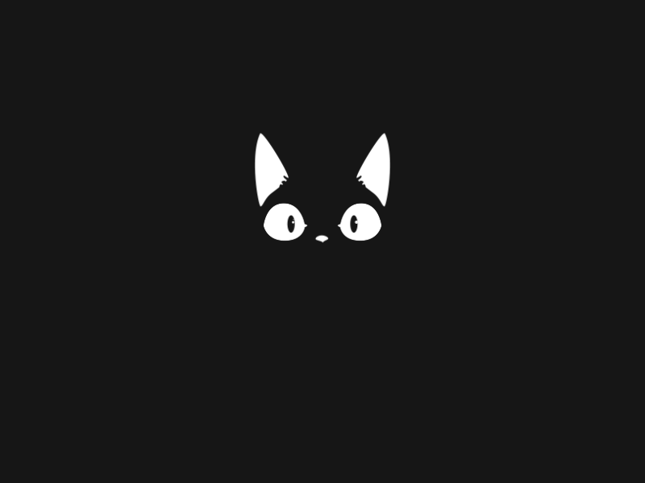

---
aggregation:
  extension:
    type: splash
    id: 2135195
appstream:
  name: Kuro
  summary: Анимированная заставка с котом для экрана запуска Plasma.
  developer:
    name: Alan Bouteiller
    nickname: bouteillerAlan
  url:
    homepage: https://github.com/bouteillerAlan/kuro
    bugtracker: https://github.com/bouteillerAlan/kuro/issues
---

# Kuro

Анимированная заставка для KDE Plasma с милым котом, которая появляется между входом в систему и запуском рабочего стола. Лёгкая и аккуратная, хорошо смотрится в светлых и тёмных темах.

## Особенности

- Ненавязчивая анимация во время инициализации Plasma
- Универсально подходит под разные цветовые схемы
- Простая установка и выбор через модуль «Заставка»

<!--@include: @extensions/.parts/show-install-steps.md-->
