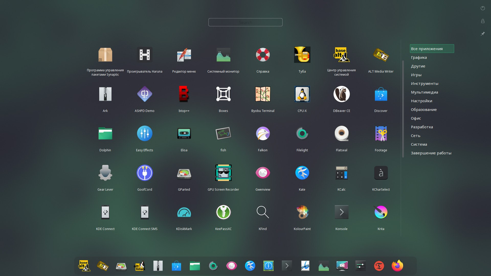

---
aggregation:
  extension:
    type: widget
    id: 2174238
appstream:
  name: Launchpad Plasma
  summary: Полноэкранное меню приложений с избранными, скрытием и быстрым поиском.
  developer:
    name: Adhe
    nickname: adhec
  url:
    homepage: https://github.com/adhec/launchpad-plasma
    bugtracker: https://github.com/adhec/launchpad-plasma/issues
---

# Launchpad Plasma

Полноэкранное меню приложений для KDE Plasma, ориентированное на простое управление списком приложений в режиме «Всё на одном экране». Поддерживает избранные, скрытие приложений и переключаемую панель фильтров.

## Особенности

- Полноэкранный режим с быстрым поиском
- Избранные приложения и скрытие ненужных
- Переключаемый список категорий/фильтров
- Минимальные зависимости, лёгкое добавление в панель

<!--@include: @extensions/.parts/show-install-steps.md-->

## Установка в качестве альтернативы меню

После установки щёлкните правой кнопкой по текущему меню приложений → «Взаимозаменяемые виджеты...» → выберите «Launchpad Plasma».
