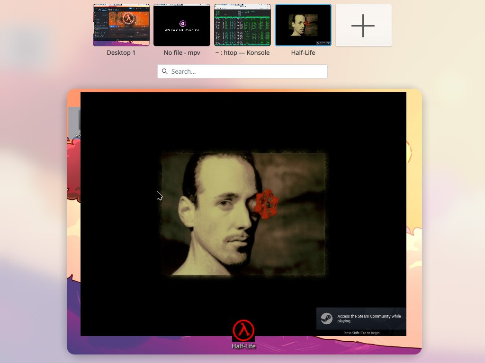

---
aggregation:
  extension:
    type: script
    id: 2141482
appstream:
  name: MACsimize6
  summary: KWin сценарий для выноса полноэкранных окон на отдельный рабочий стол
  developer:
    name: Ubiquitine
    nickname: Ubiquitine
  url:
    homepage: https://github.com/Ubiquitine/MACsimize6
    bugtracker: https://github.com/Ubiquitine/MACsimize6/issues
---

# MACsimize6

KWin сценарий для Plasma 6, добавляющий функциональность, схожую с macOS: все полноэкранные и развёрнутые окна автоматически выносятся на отдельный виртуальный рабочий стол. Это упрощает организацию пространства и управление окнами в многодисплейных или многозадачных конфигурациях.

Сценарий сохраняет удобство и привычный рабочий процесс в macOS, адаптированный к возможностям KDE Plasma.

## Основные возможности

- Автоматическое создание отдельного рабочего стола для полноэкранных окон
- Перенос всех полноэкранных и развёрнутых окон на этот рабочий стол
- Поддержка автоматического переключения между рабочими столами при активации полноэкранного режима
- Интеграция с функциями управления KWin (переключение рабочих столов, сворачивание окон)

<!--@include: @extensions/.parts/show-install-steps.md-->
