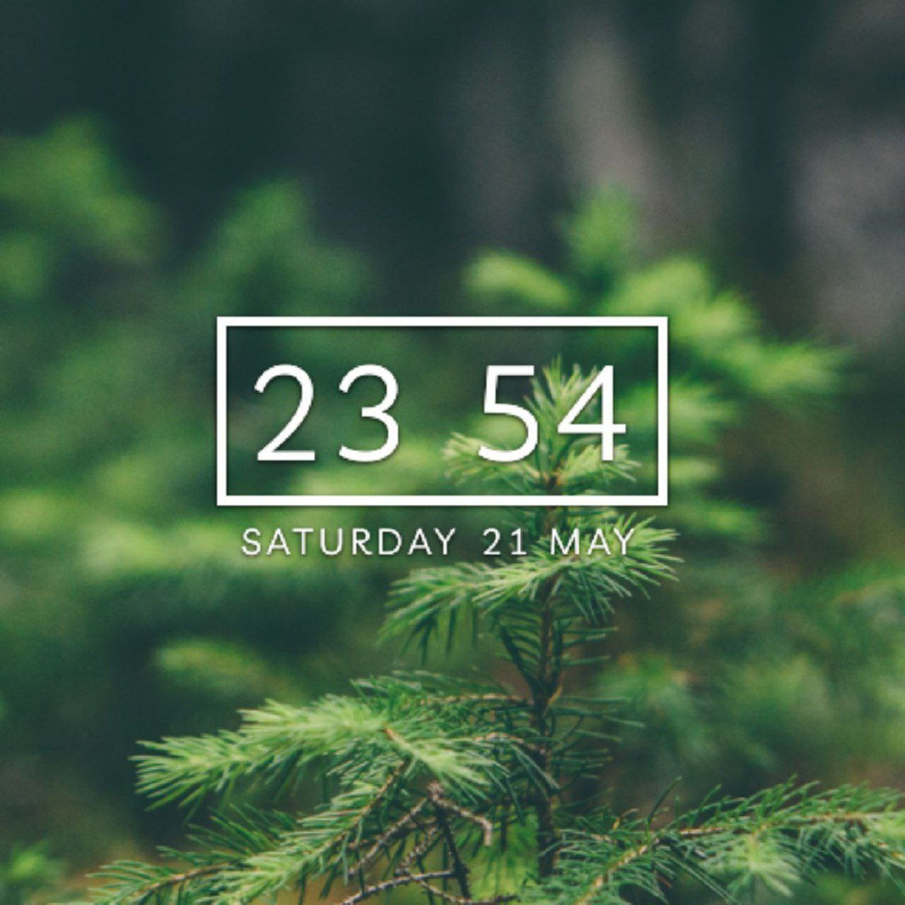

---
aggregation:
  extension:
    type: widget
    id: 1801600
appstream:
  name: Minimalist Clock
  summary: Минималистичный виджет для отображения времени.
  developer:
    name: Prayag Jain
    nickname: Prayag2
  url:
    homepage: https://github.com/Prayag2/kde_minimalistclock
    bugtracker: https://github.com/Prayag2/kde_minimalistclock/issues
---

# Minimalist Clock

Минималистичный виджет для отображения текущего времени с чистым и простым дизайном. Разработан для тех, кто ценит функциональность без излишних элементов и предпочитает лаконичное оформление рабочего стола.

## Основные возможности

Виджет предоставляет базовую функциональность отображения времени с возможностью настройки:

- Настройка шрифтов для отображения времени
- Регулировка теней текста для улучшения читаемости
- Настройка цветовой схемы элементов
- Гибкое размещение на рабочем столе или панели

Виджет сосредоточен на простоте использования и минималистичном внешнем виде, избегая перегруженности дополнительными функциями.

<!--@include: @extensions/.parts/show-install-steps.md-->
