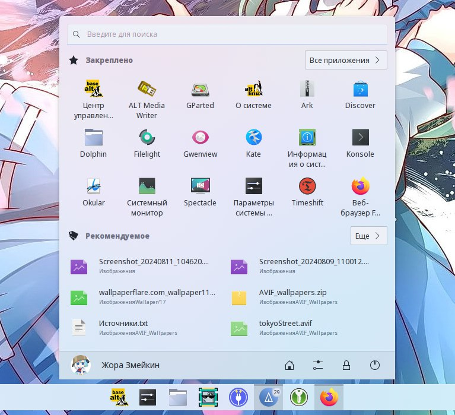

---
aggregation:
  extension:
    type: widget
    id: 1545530
appstream:
  name: OnzeMenu 11
  summary: Меню приложений в стиле Windows 11 с центровкой по экрану
  developer:
    name: Adhe
    nickname: adhec
  url:
    homepage: https://github.com/adhec/OnzeMenuKDE
    bugtracker: https://github.com/adhec/OnzeMenuKDE/issues
---

# OnzeMenu 11

Меню приложений для KDE Plasma, вдохновлённое дизайном Windows 11. Открывается строго по центру экрана, поддерживает избранные приложения, скрытие приложений и список недавних документов.

## Особенности

- Центрированное меню запуска в стиле Windows 11
- Избранные приложения и быстрый доступ
- Скрытие ненужных приложений
- Недавние документы
- Базовая кастомизация внешнего вида

<!--@include: @extensions/.parts/show-install-steps.md-->

## Установка в качестве альтернативы меню

После установки щёлкните правой кнопкой по текущему меню приложений → «**Взаимозаменяемые виджеты...**» → выберите «**OnzeMenu 11**».

## Известная проблема: пропадает иконка

Если после добавления у виджета нет иконки:

1. Откройте настройки виджета правой кнопкой мыши
2. Задайте значок вручную, например, `basealt`
