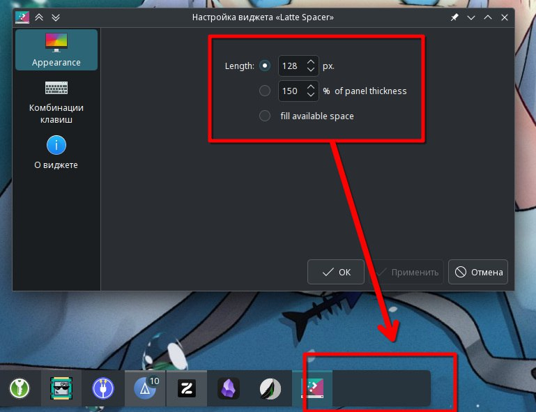

---
aggregation:
  extension:
    type: widget
    id: 2138907
appstream:
  name: Panel Spacer
  summary: Гибкий спейсер для создания пустого пространства на панели
  developer:
    name: doncsugar
    nickname: doncsugar
  url:
    homepage: https://github.com/doncsugar/applet-latte-spacer/tree/plasma6
    bugtracker: https://github.com/doncsugar/applet-latte-spacer/issues
---

# Panel Spacer

Расширенный виджет для создания пустого пространства на панели с гибкими настройками размера. Происходит из экосистемы Latte Dock и предоставляет дополнительные возможности по сравнению со встроенным разделителем.

Виджет особенно полезен для создания сложных макетов панели, где требуется точный контроль над распределением пространства между элементами. Поддерживает как фиксированный, так и адаптивный размер.

## Основные возможности

### Режимы работы

- **Гибкий режим** — автоматически заполняет доступное пространство, выталкивая виджеты к краям панели
- **Фиксированный размер** — задание точного размера в пикселях для создания постоянных отступов

### Настройка размера

- Регулировка длины спейсера для горизонтальных панелей
- Настройка высоты для вертикальных панелей
- Минимальный и максимальный размер для гибкого режима

## Примеры использования

Типичные сценарии применения виджета:

- Центрирование группы виджетов путём размещения спейсеров по краям
- Создание отступов между логическими группами элементов панели
- Разделение панели на зоны (например, левая часть для меню, правая для системного трея)
- Выравнивание виджетов по краям панели

::: tip Центрирование элементов
Для центрирования виджетов на панели разместите по одному спейсеру в гибком режиме слева и справа от группы виджетов, которые хотите разместить по центру.
:::

<!--@include: @extensions/.parts/show-install-steps.md-->
