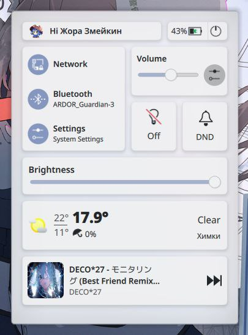

---
aggregation:
  extension:
    type: widget
    id: 2139890
appstream:
  name: Plasma Control Hub
  summary: Виджет центра управления для KDE Plasma, стилизованный под macOS.
  developer:
    name: Zayron
    nickname: zayronxio
  url:
    homepage: https://github.com/zayronxio/Plasma-Control-Hub
    bugtracker: https://github.com/zayronxio/Plasma-Control-Hub/issues
---

# Plasma Control Hub

Виджет центра управления для KDE Plasma, стилистически напоминающий его аналог из macOS. Отличается удобством и компактностью, предоставляя быстрый доступ к основным функциям системы из единого интерфейса.

Виджет объединяет наиболее востребованные элементы управления в одном месте, освобождая панель задач от множества отдельных иконок. Особенно полезен на ноутбуках, где экономия места имеет первостепенное значение.

## Основные возможности

Виджет включает следующие компоненты управления:

- Профиль пользователя с возможностью отключения
- Индикатор заряда батареи с визуализацией уровня заряда
- Кнопка выключения компьютера
- Панель управления сетевыми подключениями
- Переключатель состояния Bluetooth
- Быстрый доступ к системным настройкам
- Регулятор громкости с прямым доступом к настройкам звука
- Управление ночным светом для снижения нагрузки на глаза
- Режим «Не беспокоить» для отключения уведомлений
- Регулятор яркости экрана
- Информационный блок погоды с возможностью отключения
- Элементы управления мультимедиа

### Зависимости

Для корректной работы виджета требуются следующие пакеты:

- KDE Plasma версии 6.0 и выше
- `plasma-nm` — управление сетевыми подключениями
- `kdeplasma-addons` — дополнительные компоненты Plasma
- `plasma-pa` — управление звуком PulseAudio
- KDE Connect — интеграция с мобильными устройствами

<!--@include: @extensions/.parts/show-install-steps.md-->
