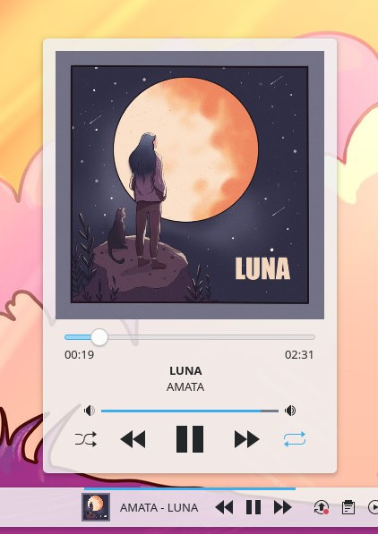

---
aggregation:
  extension:
    type: widget
    id: 2128143
  sisyphus: plasma-applet-plasmusic-toolbar
appstream:
  name: PlasMusic Toolbar
  summary: Виджет управления воспроизведением музыки на панели
  developer:
    name: Claudio Catterina
    nickname: ccatterina
  url:
    homepage: https://github.com/ccatterina/plasmusic-toolbar
    bugtracker: https://github.com/ccatterina/plasmusic-toolbar/issues
---

# PlasMusic Toolbar

Простой и функциональный виджет, отображающий информацию о текущей композиции и предоставляющий элементы управления воспроизведением прямо на панели. Совместим как с горизонтальными, так и с вертикальными панелями, а также может использоваться как виджет рабочего стола.

Виджет работает через протокол MPRIS2, поддерживая большинство популярных музыкальных плееров Linux. Отличается гибкой настройкой внешнего вида и компактным размещением элементов управления.

## Основные возможности

Виджет предоставляет два режима отображения:

### Панельный режим

- Отображение названия композиции и исполнителя с настраиваемой прокруткой
- Базовые элементы управления: воспроизведение, пауза, следующий и предыдущий трек
- Выбор между иконкой виджета или обложкой альбома
- Настройка максимальной ширины текста и скорости прокрутки
- Возможность скрыть элементы управления для экономии места

### Полный режим

- Крупная обложка альбома
- Расширенные элементы управления: воспроизведение, пауза, следующий, предыдущий, перемешивание и повтор
- Регулятор громкости
- Ползунок позиции трека для быстрой перемотки

## Настройка

Доступна гибкая кастомизация виджета:

- Изменение шрифта отображаемого текста
- Выбор иконки для панельного режима
- Переключение между источниками MPRIS2 при одновременной работе нескольких плееров
- Настройка видимости отдельных элементов в панели
- Регулировка ширины текста и поведения прокрутки

<!--@include: @extensions/.parts/install-from-repository.md-->
<!--@include: @extensions/.parts/show-install-steps.md-->
