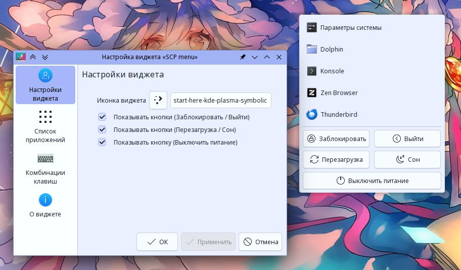

---
aggregation:
  extension:
    type: widget
    id: 2137217
appstream:
  name: Simple Customizable Power Menu for KDE
  summary: Минималистичный виджет меню выключения с базовыми опциями.
  developer:
    name: divinae
    nickname: divinae
  url:
    homepage: https://gitlab.com/divinae/uswitch
    bugtracker: https://gitlab.com/divinae/uswitch/issues
---

# Simple Customizable Power Menu for KDE

Простой и лёгкий виджет меню выключения для KDE Plasma, предназначенный для пользователей, предпочитающих минималистичный подход. Содержит основные опции управления питанием без излишних функций и сложной настройки.

Виджет идеально подходит для создания чистого интерфейса рабочего стола с быстрым доступом к наиболее важным действиям. В отличие от полнофункциональных меню питания, Simple Power Menu фокусируется на простоте и чёткости.

## Важное замечание

::: warning Размещение виджета
Этот виджет размещается через стандартное меню добавления виджетов и **не является заменой встроенному меню приложений**. Используйте его как дополнительный элемент на панели или рабочем столе для быстрого доступа к функциям выключения.
:::

<!--@include: @extensions/.parts/show-install-steps.md-->
