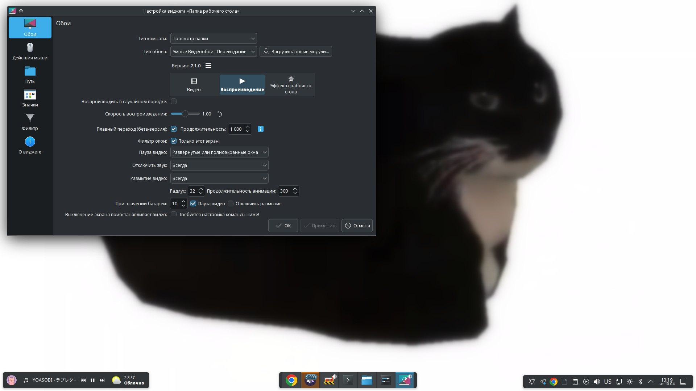

---
aggregation:
  extension:
    type: widget
    id: 2139746
  sisyphus: plasma-addon-smart-video-wallpaper-reborn
appstream:
  name: Smart Video Wallpaper Reborn
  summary: Плагин для воспроизведения видео в качестве обоев рабочего стола в KDE Plasma
  developer:
    name: Luis Bocanegra
    nickname: luisbocanegra
  url:
    homepage: https://github.com/luisbocanegra/plasma-smart-video-wallpaper-reborn
    bugtracker: https://github.com/luisbocanegra/plasma-smart-video-wallpaper-reborn/issues
---

# Smart Video Wallpaper Reborn

Плагин позволяет использовать видео в качестве обоев рабочего стола или экрана блокировки, превращая статичный фон в живое пространство.

Расширение поддерживает воспроизведение как одиночного видео, так и слайд шоу с несколькими файлами. Доступны плавные кроссфейд переходы между видео, управление скоростью и громкостью воспроизведения, а также настройка произвольного или случайного порядка.

## Основные возможности

Плагин включает систему автоматической паузы видео при различных условиях:

- Развёрнутое или полноэкранное окно
- Активное окно на переднем плане
- При наличии любого открытого окна
- При активации эффектов рабочего стола (например, обзор или показ рабочего стола)
- Когда экран выключен или заблокирован

Дополнительно доступна функция размытия фона с настраиваемыми условиями активации, радиусом и продолжительностью анимации. Для экономии заряда батареи предусмотрен специальный режим с настраиваемым порогом, автоматически приостанавливающий видео и отключающий размытие при низком уровне заряда.

<!--@include: @extensions/.parts/install-from-repository.md-->
<!--@include: @extensions/.parts/show-install-steps.md-->
