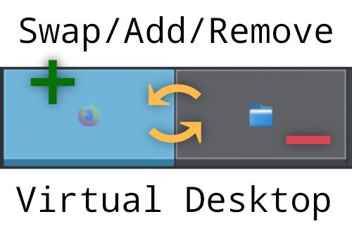

---
aggregation:
  extension:
    type: script
    id: 2164947
appstream:
  name: Swap/Add/Remove - Virtual Desktop Shortcuts
  summary: Расширенные горячие клавиши для управления виртуальными рабочими столами.
  developer:
    name: dedean16
    nickname: dedean16
  url:
    homepage: https://github.com/dedean16/kwin-swapdesktop
    bugtracker: https://github.com/dedean16/kwin-swapdesktop/issues
---

# Swap/Add/Remove - Virtual Desktop Shortcuts

Сценарий KWin, добавляющий расширенный набор горячих клавиш для продвинутого управления виртуальными рабочими столами. Позволяет быстро менять местами окна между рабочими столами, создавать и удалять рабочие столы с клавиатуры без использования мыши.

Сценарий особенно полезен для пользователей, активно работающих с несколькими рабочими столами и предпочитающих управление через клавиатуру. Заполняет пробелы в стандартном наборе сочетаний клавиш Plasma.

## Основные возможности

### Операции с окнами

Сценарий добавляет возможность обмена окнами между соседними рабочими столами:

- Обмен окон текущего рабочего стола с окнами справа/слева
- Обмен окон текущего рабочего стола с окнами сверху/снизу (для двумерной сетки)
- Сохранение позиций окон при обмене

### Управление рабочими столами

Быстрое создание и удаление рабочих столов:

- Добавление нового рабочего стола после текущего
- Добавление нового рабочего стола перед текущим
- Удаление текущего рабочего стола с автоматическим перемещением окон на соседний

### Горячие клавиши по умолчанию

|                 Комбинация                 |                        Описание                        |
| :----------------------------------------: | :----------------------------------------------------: |
| [[Meta]] + [[Shift]] + [[Alt]] + [[Right]] |         Поменять окна с рабочим столом справа          |
| [[Meta]] + [[Shift]] + [[Alt]] + [[Left]]  |          Поменять окна с рабочим столом слева          |
|  [[Meta]] + [[Shift]] + [[Alt]] + [[Up]]   |         Поменять окна с рабочим столом сверху          |
| [[Meta]] + [[Shift]] + [[Alt]] + [[Down]]  |          Поменять окна с рабочим столом снизу          |
|   [[Meta]] + [[Shift]] + [[Alt]] + [[+]]   |          Добавить рабочий стол после текущего          |
|         [[Meta]] + [[Alt]] + [[=]]         |          Добавить рабочий стол перед текущим           |
|   [[Meta]] + [[Shift]] + [[Alt]] + [[-]]   | Удалить текущий рабочий стол (окна переносятся вперёд) |
|         [[Meta]] + [[Alt]] + [[-]]         | Удалить текущий рабочий стол (окна переносятся назад)  |

::: tip Настройка сочетаний клавиш
Все горячие клавиши можно изменить в разделе «Параметры системы» → «Клавиатура» → «Комбинации клавиш». Найдите группу действий с названием сценария или поиском по слову "desktop".
:::

<!--@include: @extensions/.parts/show-install-steps.md-->

## Примеры использования

### Перестановка окон между рабочими столами

Представьте, что на первом рабочем столе у вас открыты браузеры, а на втором — текстовые редакторы, но вы хотите поменять их местами. Вместо ручного перемещения каждого окна достаточно перейти на первый рабочий стол и нажать [[Meta]] + [[Shift]] + [[Alt]] + [[Right]].

### Быстрая организация рабочего пространства

При работе над новой задачей можно быстро создать рабочий стол между текущим и следующим с помощью [[Meta]] + [[Alt]] + [[=]], не нарушая последовательность существующих рабочих столов.

### Очистка пространства

Закончили работу над задачей и хотите удалить рабочий стол? [[Meta]] + [[Alt]] + [[-]] удалит текущий рабочий стол и автоматически переместит окна на предыдущий, сохраняя их расположение.

## Совместимость с другими сценариями

::: warning Конфликты с другими сценариями
Сценарий может конфликтовать с другими расширениями, управляющими виртуальными рабочими столами, такими как [Temporary Virtual Desktops](/extensions/temporary-virtual-desktops/) или [Dynamic Workspaces](/extensions/dynamic-workspaces/). Используйте только один сценарий для автоматического управления рабочими столами.
:::

Сценарий работает независимо от стандартных функций переключения между рабочими столами и не мешает встроенным горячим клавишам Plasma.
