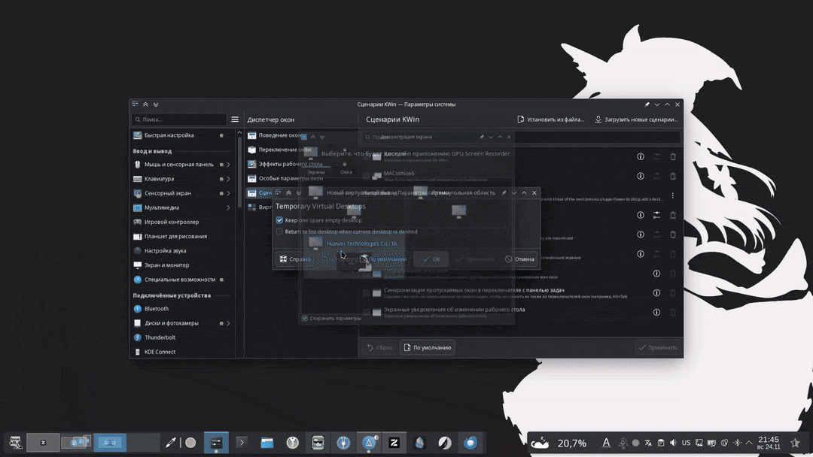

---
aggregation:
  extension:
    type: script
    id: 2138035
appstream:
  name: Temporary Virtual Desktops
  summary: Сценарий KWin для автоматического управления виртуальными рабочими столами.
  developer:
    name: Ubiquitine
    nickname: Ubiquitine
  url:
    homepage: https://github.com/Ubiquitine/temporary-virtual-desktops
    bugtracker: https://github.com/Ubiquitine/temporary-virtual-desktops/issues
---

# Temporary Virtual Desktops

Сценарий KWin для автоматического создания и удаления виртуальных рабочих столов по аналогии с GNOME Shell. Рабочий стол автоматически удаляется при его освобождении, обеспечивая динамическое управление рабочим пространством без ручного вмешательства.

Сценарий представляет собой адаптацию для Plasma 6 оригинального проекта и предоставляет гибкие настройки поведения, включая возможность сохранения одного свободного рабочего стола.

## Основные возможности

### Автоматическое управление

- Автоматическое удаление пустых виртуальных рабочих столов при их освобождении
- Сохранение минимум одного рабочего стола в системе
- Автоматическая перенумерация оставшихся рабочих столов после удаления

### Настройка поведения

- **Keep one spare empty desktop** — опциональное сохранение одного пустого рабочего стола для быстрого доступа
- Игнорирование окон, помеченных как пропускаемые в панели задач
- Плавная интеграция с функциями переключения рабочих столов

<!--@include: @extensions/.parts/show-install-steps.md-->

## Настройка

::: warning Важная настройка
По умолчанию сценарий не оставляет свободный рабочий стол! Для удобства работы рекомендуется включить опцию «Keep one spare empty desktop» в параметрах сценария.
:::

После установки откройте настройки сценария в разделе «Сценарии KWin» и установите галочку напротив «Keep one spare empty desktop». Это обеспечит наличие одного свободного рабочего стола для размещения новых окон без необходимости ручного создания.

## Принцип работы

Сценарий отслеживает следующие события:

- Добавление нового окна
- Удаление окна
- Изменение списка рабочих столов
- Переключение текущего рабочего стола

При возникновении любого из этих событий сценарий проверяет все виртуальные рабочие столы и удаляет пустые, кроме последнего (если включена опция сохранения свободного рабочего стола).

## Отличия от стандартного поведения

В отличие от стандартного управления виртуальными рабочими столами в Plasma:

- Не требуется ручного создания и удаления рабочих столов
- Количество рабочих столов динамически адаптируется под текущую нагрузку
- Отсутствуют неиспользуемые пустые рабочие столы (опционально)
- Более близкое к GNOME Shell поведение для пользователей, привыкших к этому окружению
