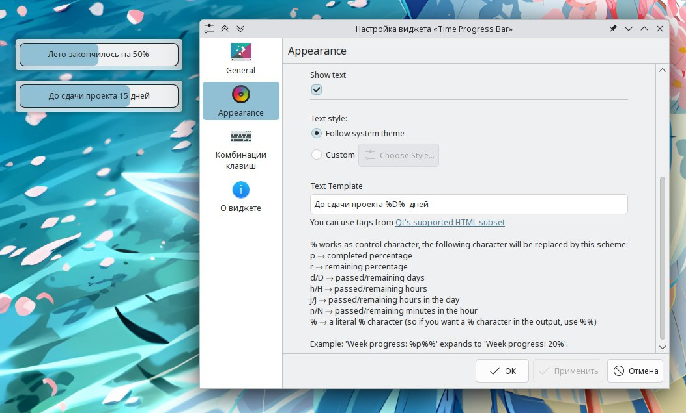

---
aggregation:
  extension:
    type: widget
    id: 2126775
appstream:
  name: Time Progress Bar
  summary: Виджет прогресс-бара для отслеживания прошедшего времени
  developer:
    name: Tino Lorenz
    nickname: tilorenz
  url:
    homepage: https://github.com/tilorenz/TimeProgressBar
    bugtracker: https://github.com/tilorenz/TimeProgressBar/issues
---

# Time Progress Bar

Виджет, позволяющий отслеживать прошедшее время в формате прогресс-бара. Идеально подходит для визуализации временных промежутков — от рабочих смен до годовых периодов.

Виджет вдохновлён популярными таймерами прогресса года и расширяет эту концепцию на различные временные интервалы. Поддерживает размещение как на рабочем столе, так и на панели с гибкой настройкой внешнего вида.

## Основные возможности

Виджет предоставляет следующие режимы отслеживания времени:

- Прогресс года — отображение процента прошедших дней в текущем году
- Прогресс месяца — визуализация прохождения текущего месяца
- Прогресс недели — отслеживание дней текущей недели
- Прогресс дня — мониторинг прошедшего времени суток
- Произвольный интервал — настраиваемый период между двумя датами и временем

Доступна настройка шрифтов, текста, внешнего вида прогресс-бара и других параметров отображения для адаптации виджета под индивидуальные предпочтения.

## Важное замечание

::: info
При установке произвольной даты убедитесь, что начальная дата и время предшествуют текущему моменту. В противном случае виджет отобразит ошибку «NaN» в тексте, а прогресс-бар останется пустым.
:::

<!--@include: @extensions/.parts/show-install-steps.md-->
