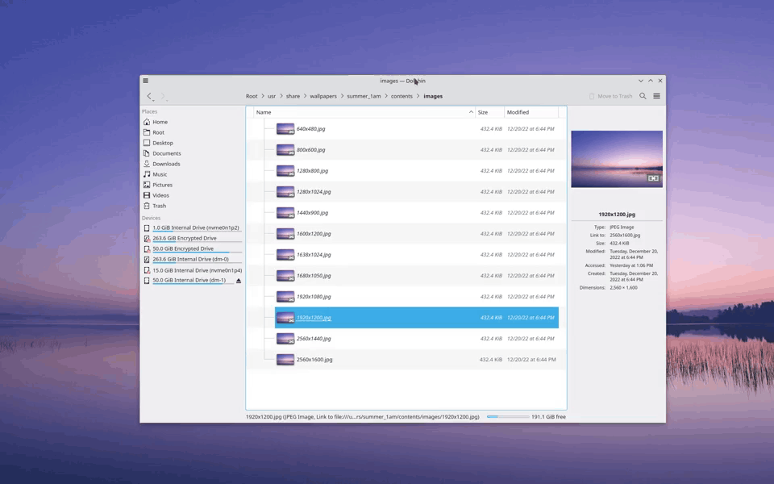

---
aggregation:
  extension:
    type: script
    id: 2136524
appstream:
  name: Truely Maximized
  summary: Автоматически скрывает заголовок у развёрнутых окон для максимизации пространства.
  developer:
    name: fin444
    nickname: fin444
  url:
    homepage: https://github.com/fin444/truely-maximized
    bugtracker: https://github.com/fin444/truely-maximized/issues
---

# Truely Maximized

Сценарий KWin, который «по‑настоящему» максимизирует рабочее пространство: скрывает заголовки окон при разворачивании и возвращает их при обычном размере. Полезно на небольших экранах и когда заголовки отвлекают от содержания.

## Возможности

- Автоматически скрывает заголовок у развёрнутых окон
- Возвращает заголовок при выходе из развёрнутого режима
- Чёрный список приложений/классов окон, для которых поведение не применяется
- Опция игнорирования приложений с потенциальными проблемами от скрытия заголовка

## Горячие клавиши

|             Комбинация              |                 Описание                 |
| :---------------------------------: | :--------------------------------------: |
|       [[Meta]] + [[Page Up]]        |          Вернуть заголовок окна          |
| [[Meta]] + [[LMB]] (перетаскивание) | Альтернативный способ сбросить состояние |

<!--@include: @extensions/.parts/show-install-steps.md-->
