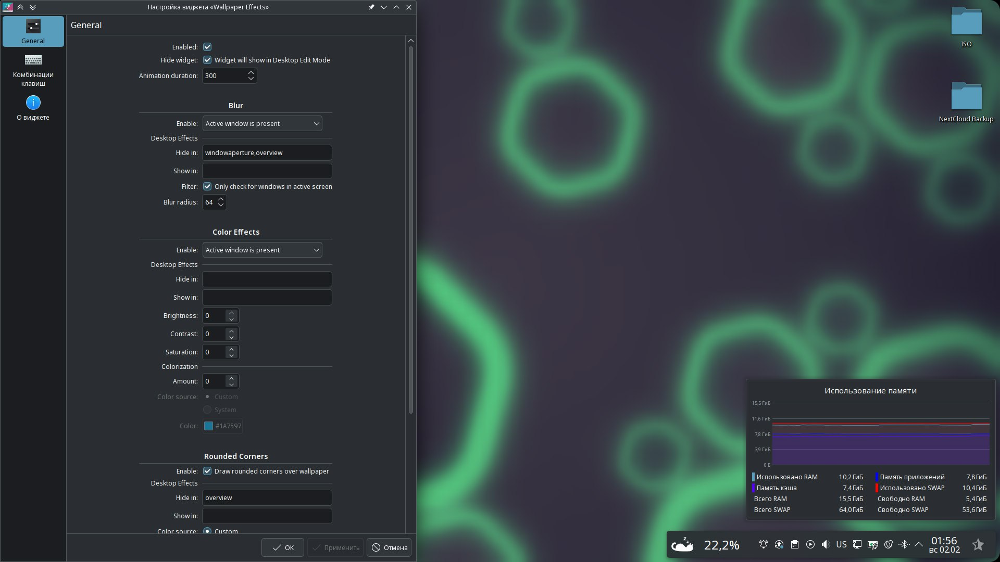

---
aggregation:
  extension:
    type: widget
    id: 2145723
appstream:
  name: Wallpaper Effects
  summary: Виджет для добавления визуальных эффектов к обоям рабочего стола.
  developer:
    name: Luis Bocanegra
    nickname: luisbocanegra
  url:
    homepage: https://github.com/luisbocanegra/plasma-wallpaper-effects
    bugtracker: https://github.com/luisbocanegra/plasma-wallpaper-effects/issues
---

# Wallpaper Effects

Невидимый виджет для добавления визуальных эффектов к обоям рабочего стола. Позволяет динамически изменять внешний вид фона в зависимости от состояния окон и рабочего стола, работая с любыми плагинами обоев.

Виджет вдохновлён расширениями [Active Blur](/extensions/active-blur/) и Blurred Wallpaper, но предоставляет значительно более широкий набор эффектов и настроек. В отличие от встроенных возможностей, поддерживает тонкую настройку условий активации эффектов и комбинирование различных визуальных преобразований.

v
## Основные возможности

### Эффект размытия

- Настройка радиуса размытия
- Плавные переходы между состояниями
- Совместимость со всеми плагинами обоев

### Закруглённые углы

- Регулировка радиуса закругления
- Настройка цвета фона
- Индивидуальные отступы (сверху, снизу, слева, справа)
- Добавление теней

### Цветовые эффекты

- Тонирование обоев выбранным цветом
- Регулировка яркости изображения
- Управление контрастностью
- Настройка насыщенности цветов

### Шейдерные эффекты

- Пикселизация с настраиваемым размером пикселя
- Эффект зернистости с анимацией
- Регулировка размера и интенсивности зерна

### Условия активации эффектов

Виджет позволяет включать эффекты при следующих условиях:

- Развёрнутое или полноэкранное окно
- Наличие активного окна на переднем плане
- Присутствие любого открытого окна
- Активация эффектов рабочего стола (обзор, показ рабочего стола)
- Всегда (постоянное применение эффектов)
- Никогда (полное отключение)

::: warning Важно
После добавления виджета на рабочий стол откройте его настройки и установите галочку напротив «Hide widget», чтобы скрыть визуальное представление виджета. Это сделает его полностью невидимым, сохранив при этом все функциональные возможности.
:::

## Примеры использования

Типичные сценарии применения виджета:

- Затемнение обоев при работе с приложениями для снижения визуального шума
- Размытие фона при активации обзора рабочих столов для улучшения читаемости
- Автоматическое изменение яркости обоев в зависимости от наличия окон
- Создание эффекта закруглённых углов экрана для современного внешнего вида
- Применение художественных эффектов (пикселизация, зернистость) для стилизации

<!--@include: @extensions/.parts/show-install-steps.md-->
