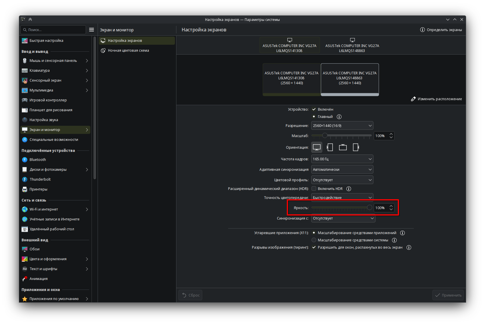

# Настройка яркости экрана

В зависимости от вашего оборудования вы можете изменить яркость экрана, чтобы сэкономить электроэнергию, снизить расход батареи ноутбука или сделать экран более читаемым при ярком освещении.

## Способы регулировки яркости

### Системный лоток

Самый быстрый способ настройки яркости — через системный лоток:

1. Нажмите на значок **Яркость и цвет** (иконка с солнцем) в правой части панели задач
2. В открывшемся меню отрегулируйте ползунок яркости для нужного монитора
3. При наличии нескольких экранов каждый из них будет иметь отдельный ползунок

### Настройка конкретного экрана

Для более детальной настройки яркости отдельного монитора:

1. Откройте **Параметры системы** → **Экран и монитор** → **Настройка экранов**
2. Выберите нужный экран из списка
3. Отрегулируйте ползунок **Яркость** в нижней части окна

### Управление питанием

Для настройки автоматического управления яркостью и энергосбережения:

1. Откройте **Параметры системы** → **Управление питанием**
2. В разделе **Экран и яркость** настройте:
   - **Затемнение экрана через** — время бездействия до снижения яркости
   - **Отключение экрана через** — время до выключения монитора

### Горячие клавиши

Большинство ноутбуков имеют специальные клавиши для быстрой регулировки яркости:

- Найдите на клавиатуре клавиши с изображением солнца
- Используйте их в сочетании с клавишей `Fn` для увеличения или уменьшения яркости

:::info
При наличии встроенного датчика освещённости яркость экрана может автоматически регулироваться в зависимости от внешнего освещения. Эта функция настраивается в разделе **Параметры системы** → **Управление питанием**.
:::

:::tip
Начиная с KDE Plasma 6.2 добавлена возможность независимой настройки яркости для каждого подключенного монитора через виджет в системном лотке, что особенно удобно при работе с несколькими дисплеями.
:::
