# Базовые сценарии работы с файловым менеджером Dolphin в KDE Plasma

## Введение

**Dolphin** — это стандартный файловый менеджер среды рабочего стола **KDE Plasma**. Он предназначен для повседневной работы с файлами и каталогами и сочетает в себе простоту для начинающих пользователей и широкий набор возможностей для продвинутых сценариев.

Если вы ранее использовали Windows Explorer, Finder (macOS) или файловые менеджеры других Linux-окружений (например, Nautilus в GNOME), Dolphin будет интуитивно понятен, но при этом предложит ряд дополнительных функций, характерных именно для KDE.

## Запуск Dolphin

Запустить Dolphin можно несколькими способами:

* **Через меню приложений KDE**
  Меню → Система → Dolphin (или «Файловый менеджер»)

  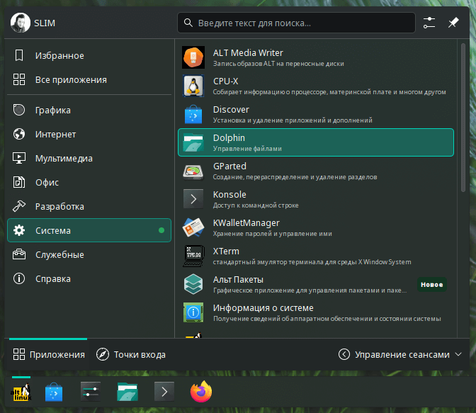

* **Через значок на панели** (обычно присутствует по умолчанию)

:::tip
Если значок не отображается, его можно добавить через контекстное меню в Меню запуска приложений:  
**Правый клик по пункту меню Dolphin → Закрепить на панели задач**.

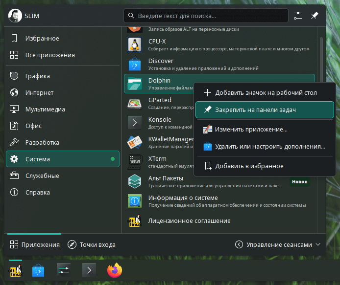

:::
* **С помощью сочетания клавиш**
  `Meta (Win) + E`
* **Из терминала**

  ```bash
  dolphin
  ```

После запуска откроется главное окно файлового менеджера.

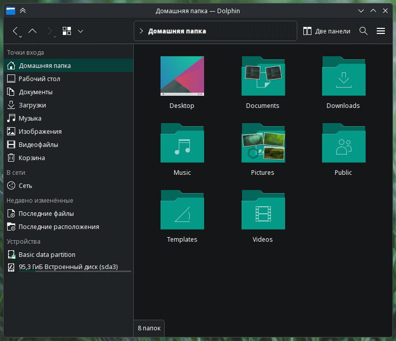

## Обзор интерфейса Dolphin

### Основные элементы окна

1. **Панель меню** (по умолчанию убрана в кнопку «бургер-меню»)

:::tip
Для отображения меню в виде панели нужно нажать на кнопку меню («бургер-меню») и в открывшемся списке выбрать `Дополнительно` и `Показать меню со всеми действиями` либо же просто управлять режимом отображения панели меню через комбинацию клавиш `Ctrl + M`.

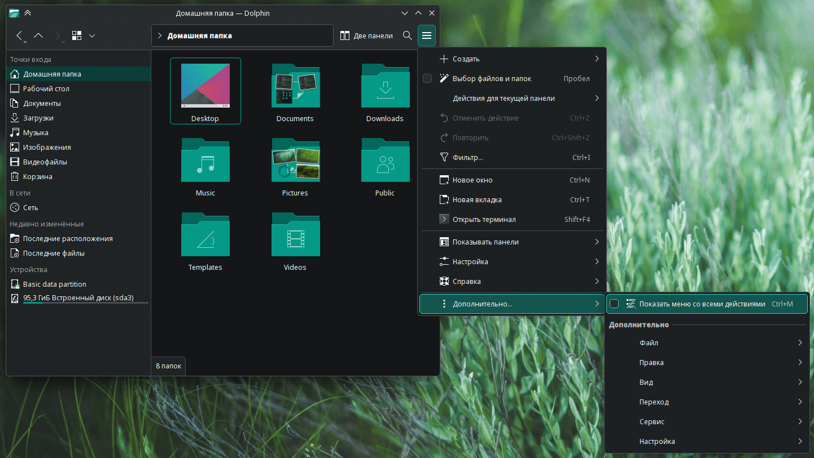
:::

2. **Панель навигации**

   * Назад / Вперёд
   * Вверх (к родительскому каталогу)

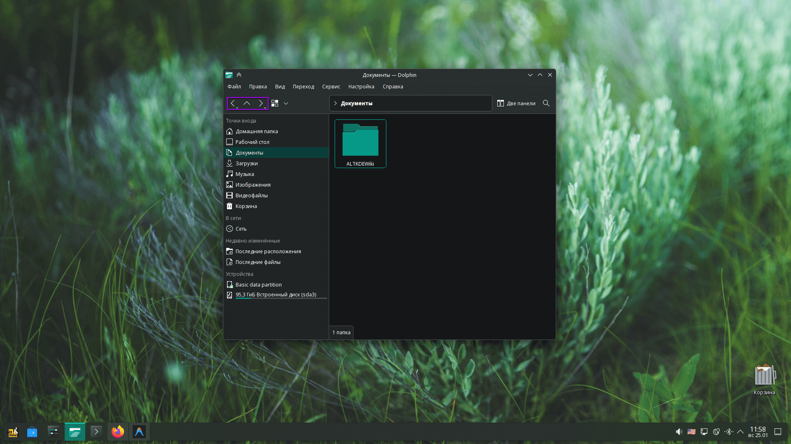

3. **Адресная строка**

   * Отображает текущий путь
   * Может работать в двух режимах:

     * *Навигационный* (кнопки каталогов)

     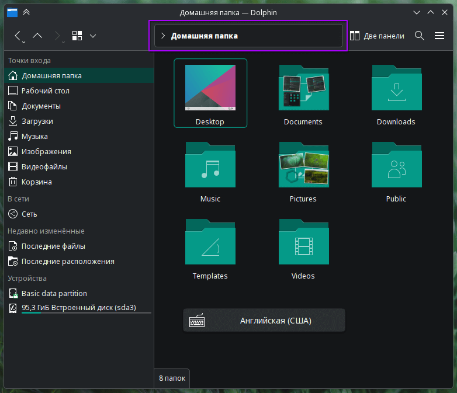

     * *Текстовый* (полный путь, переключение по `Ctrl + L`)

     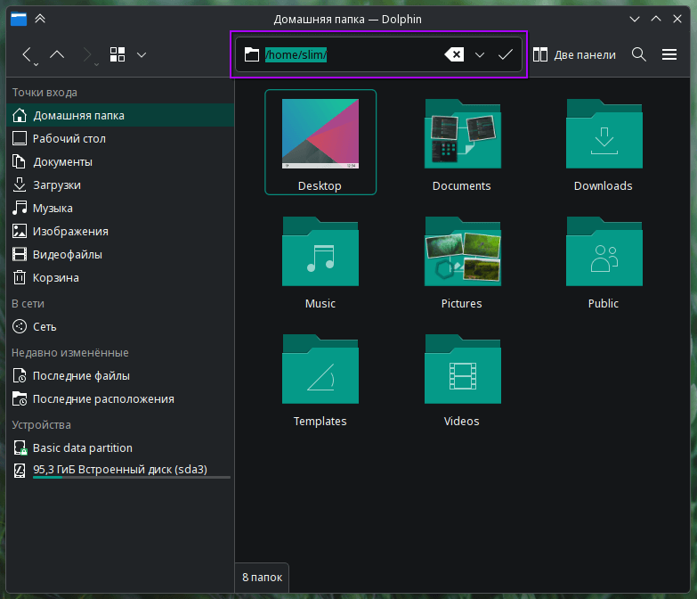

4. **Панель инструментов**
   
   По обе стороны от адресной строки расположены важные инструменты управления:
   * **Настройка режимов просмотра**
   * **Две панели** (`F3`) — включает двухпанельный режим.
   * **Поиск** (`Ctrl + F`) — открывает строку поиска. 
   * **Кнопка меню** («бургер-меню») — доступ к полному списку настроек и функций. Панель меню по умолчанию скрыта.

   

  :::tip
  **Добавление и удаление кнопок панели инструментов**
  На панели инструментов файлового менеджера часто используемые функции расположены в виде кнопок.
  Можно добавлять и удалять кнопки, располагать их в нужном порядке.

  Для этого нужно:

  1. Открыть пункт меню **Настройка** (в панели меню, либо через кнопку «бургер-меню»)
  2. Перейти в раздел **Настроить панели инструментов**

  * В левой колонке есть все возможные команды и разделители, в правой - те ярлыки, которые есть сейчас на панели. Для быстрого поиска над панелями есть фильтр для текстового поиска.
  * Стрелочки в центре предназначены для перемещения ярлыков.
  * Для добавления нового ярлыка найдите нужную команду, нажмите стрелочку «вправо» или дважды щелкните по ней мышью. Ярлык будет скопирован в правую колонку. Таким же образом можно вставить разделитель.
  * Для удаления ярлыка найдите его в правой колонке и нажмите стрелочку «влево» или дважды щелкните по нему мышью.

  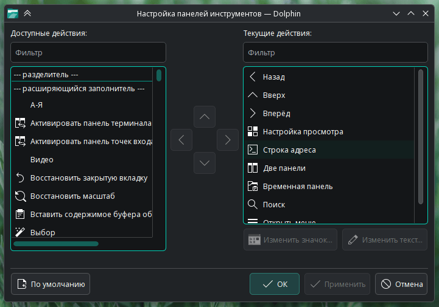
  :::

5. **Боковая панель (Places / Места)**
   Содержит быстрый доступ к:

   * Домашнему каталогу и его подкаталогам (Документы, Загрузки, Изображения и т.д.)
   * Корзине
   * Сетевым ресурсам
   * Недавно измененным файлам и расположениям.
   * Подключённым дискам и флеш-накопителям

   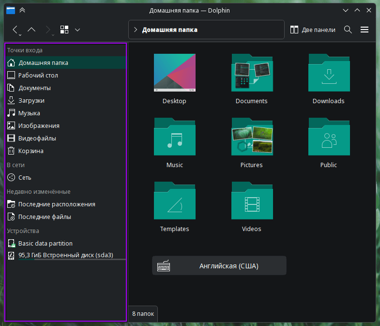

6. **Основная область**
   Здесь отображается содержимое текущей папки.

   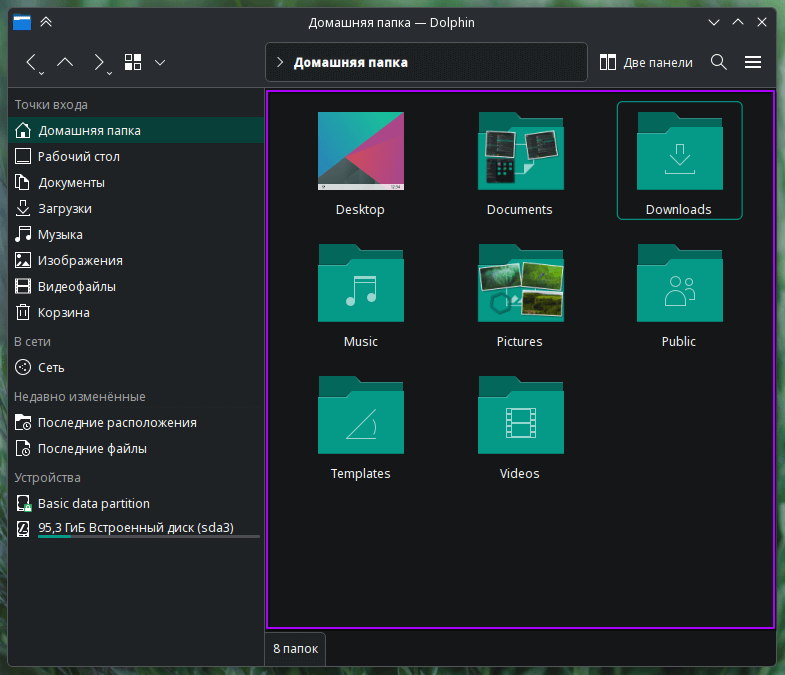

7. **Строка состояния**
   Показывает количество файлов, размер выделенных элементов и другую информацию.

   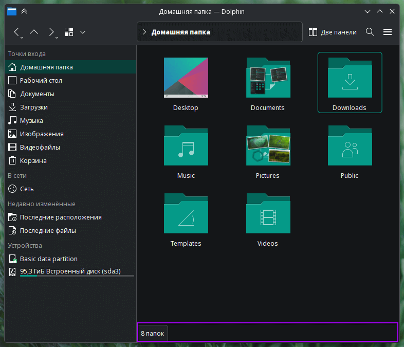

## Навигация по файловой системе

### Переход между папками

* **Двойной щелчок мыши** — открыть папку
* **Одинарный щелчок** (если включён соответствующий режим) — открыть папку

 

* **Кнопка «Назад» / «Вперёд»**
* **Кнопка «Вверх»** — переход на уровень выше
* **Использование боковой панели** — быстрый доступ к важным каталогам

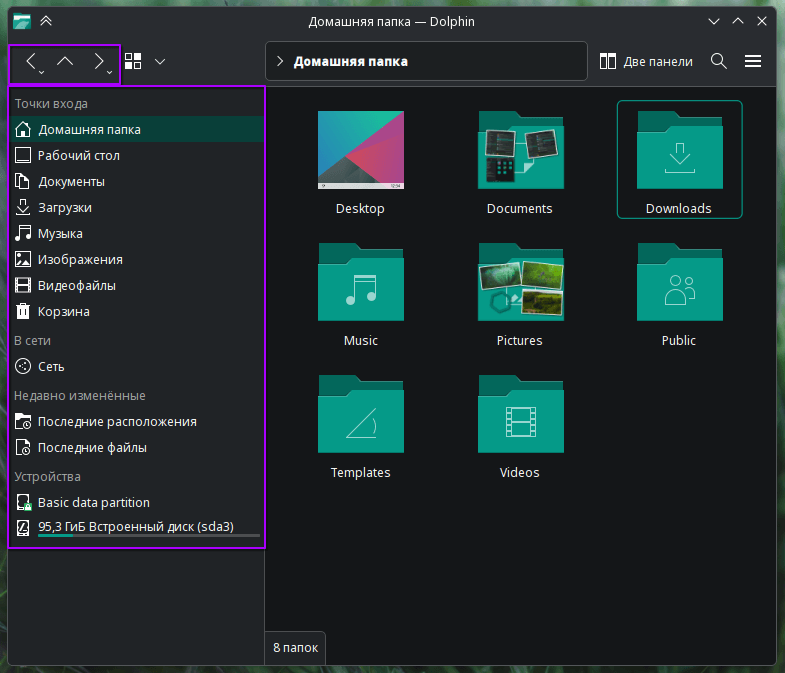

### Работа с адресной строкой

* Нажмите `Ctrl + L`, чтобы вручную ввести путь (например: `/home/user/Documents`)
* Нажмите `Esc`, чтобы вернуться в навигационный режим

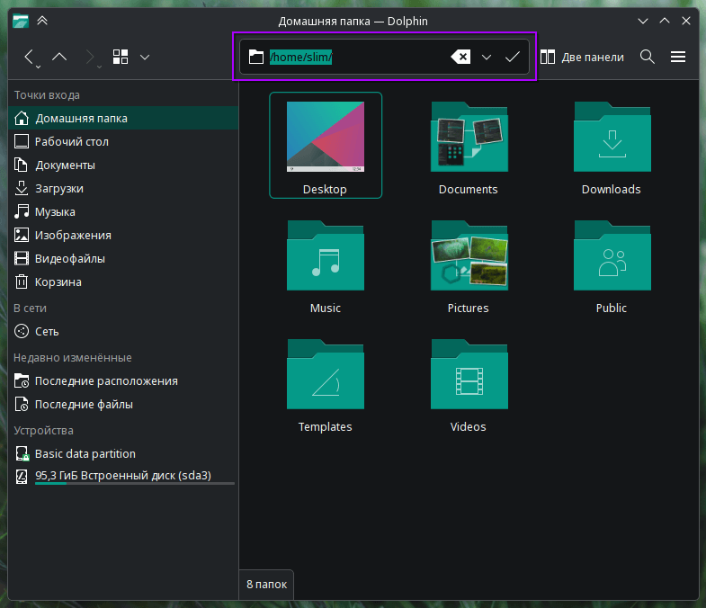

## Отображение файлов и папок

Dolphin поддерживает несколько режимов просмотра:

* **Значки** — удобен для изображений и мультимедиа


* **Столбцы** — плотный список, экономит место

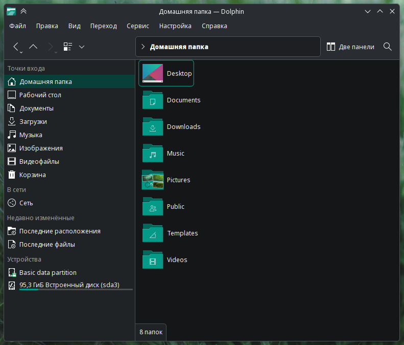

* **Таблица (Детальный вид)** — показывает размер и дату изменения

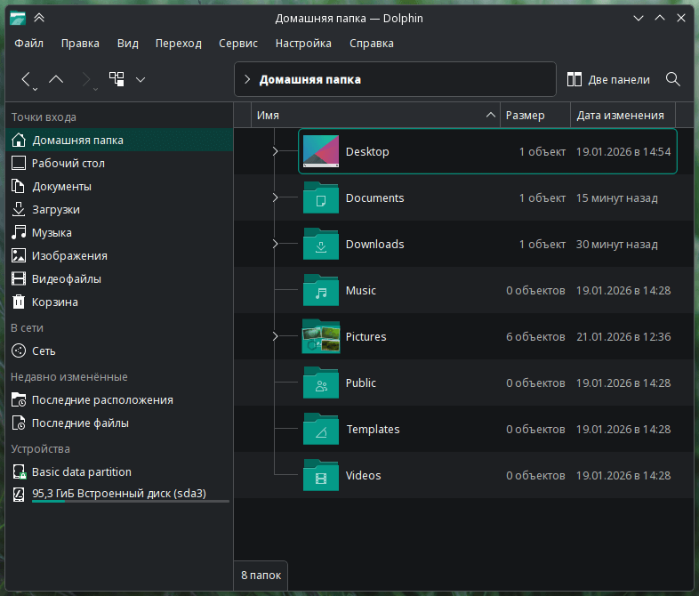

**Переключение режимов:**

* Через кнопки на панели инструментов
* Через меню **Вид**

### Настройка сортировки

Можно сортировать файлы:

* По имени
* По размеру
* По дате изменения
* По типу и пр.

Сортировка доступна:

* Через заголовки столбцов (в табличном виде)

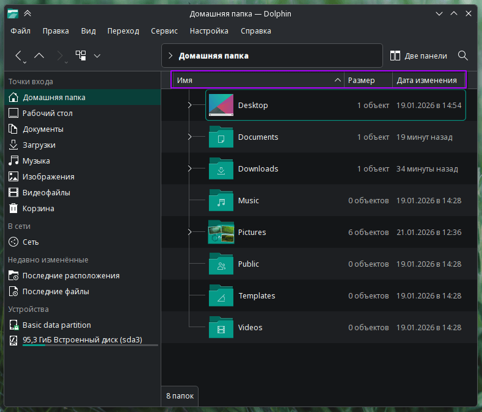

* Через меню **Вид → Сортировка**


## Основные операции с файлами

### Выделение файлов

* Один файл — одинарный щелчок
* Несколько файлов:

  * `Ctrl + щелчок` — выбор отдельных элементов
  * `Shift + щелчок` — диапазон
* Выделить всё: `Ctrl + A`

### Копирование, перемещение, удаление

* **Копировать**:
  `Ctrl + C` → `Ctrl + V`
* **Вырезать (переместить)**:
  `Ctrl + X` → `Ctrl + V`
* **Удалить в корзину**:
  `Delete`
* **Удалить без корзины**:
  `Shift + Delete`

Также поддерживается **перетаскивание мышью (Drag & Drop)**:

* Перетащить с зажатой левой кнопкой
* При отпускании можно выбрать: копировать, переместить или создать ссылку


## Работа с корзиной

Удалённые файлы по умолчанию попадают в **Корзину**.

В корзине можно:

* Восстановить файл
* Очистить корзину полностью

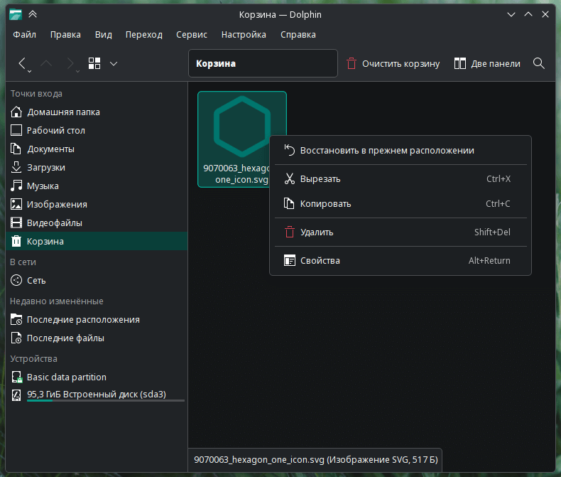

Корзина доступна:

* Через боковую панель
* По пути: `trash:/`

## Создание файлов и папок

### Создание папки

* Правый клик → **Создать → Папку**
* Или сочетание: `F10`

### Создание файлов

Через контекстное меню:

* **Создать → Текстовый файл**
* **Создать → [шаблоны файлов]**

Шаблоны можно расширять, добавляя файлы в каталог:

```
~/.local/share/templates/
```

Подробнее об этом можно почитать в разделе [Настройка меню «Создать» в Dolphin](../dolphin-templates/index.md).

### Отображение точного времени создания/изменения файлов

По умолчанию в Dolphin дата создания/изменения файлов отображается относительно текущей даты: минуту назад, час назад, день назад и т.д. 

Чтобы отобразить точное время создания/изменения файлов, нужно:

1. Открыть пункт меню **Настройка** (в панели меню, либо через кнопку «бургер-меню»)
2. Перейти в раздел **Настроить Dolphin**
3. В боковой панели выбрать **Вид**
4. Выбрать вкладку **Содержимое**
5. В разделе **Формат дат** отметить опцию **Абсолютный (...)**


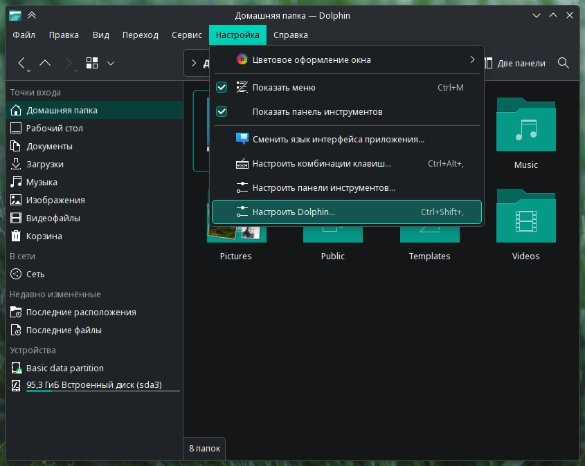
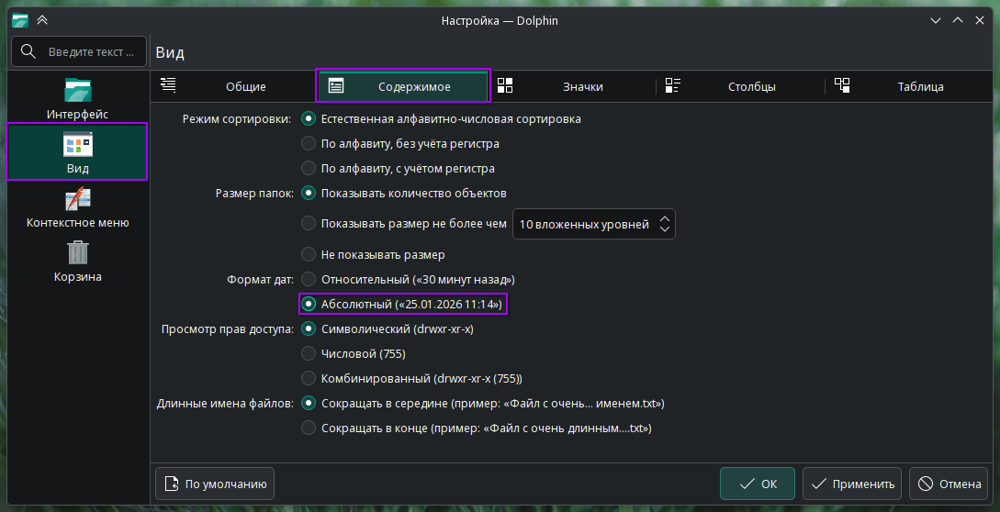

## Контекстное меню (правый клик)

Контекстное меню — ключевой элемент работы в Dolphin. Оно меняется в зависимости от выбранного объекта и может содержать:

* Открыть / Открыть с помощью
* Копировать, Вырезать, Переименовать
* Свойства
* Архивировать / Распаковать
* Действия от установленных приложений (например, Git, редакторы)

## Работа с вкладками и разделением окна

### Вкладки

Dolphin поддерживает вкладки, как в браузере:

* Новая вкладка: `Ctrl + T`
* Закрыть вкладку: `Ctrl + W`
* Переключение: `Ctrl + Tab`

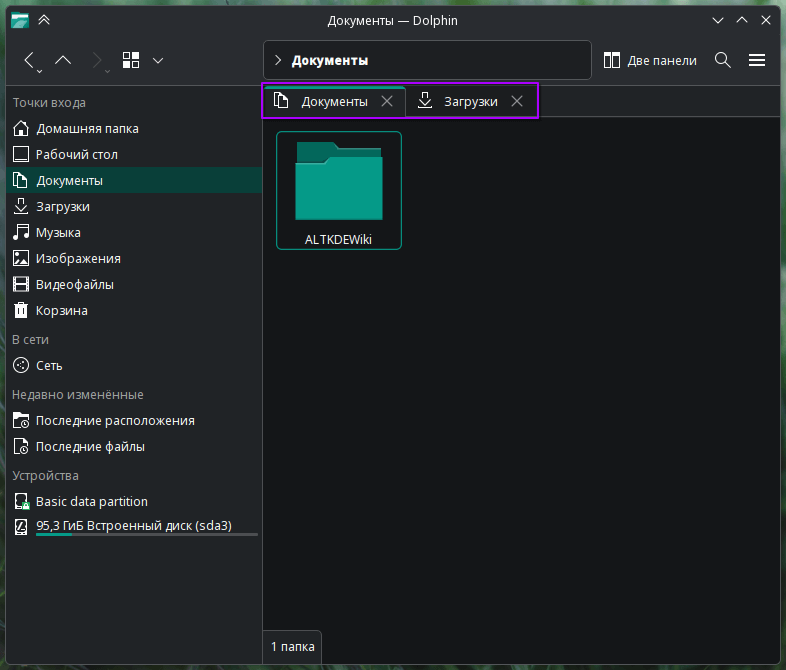

### Разделение окна

Можно разделить окно на две панели:

* `F3` — включить/выключить разделение
* Удобно для копирования файлов между каталогами

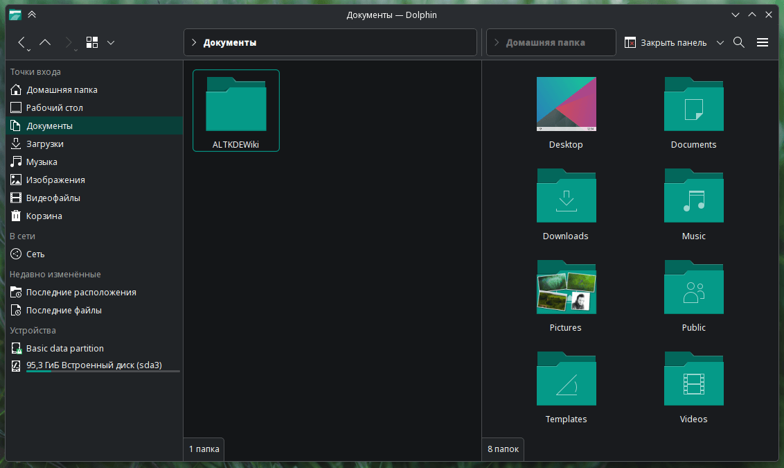

## Поиск файлов

### Быстрый поиск

* Просто начните вводить текст в текущей папке
* Dolphin отфильтрует файлы по имени

### Расширенный поиск

* Используйте строку поиска
* Можно искать:

  * По имени
  * По содержимому (если установлен индексатор, например Baloo)

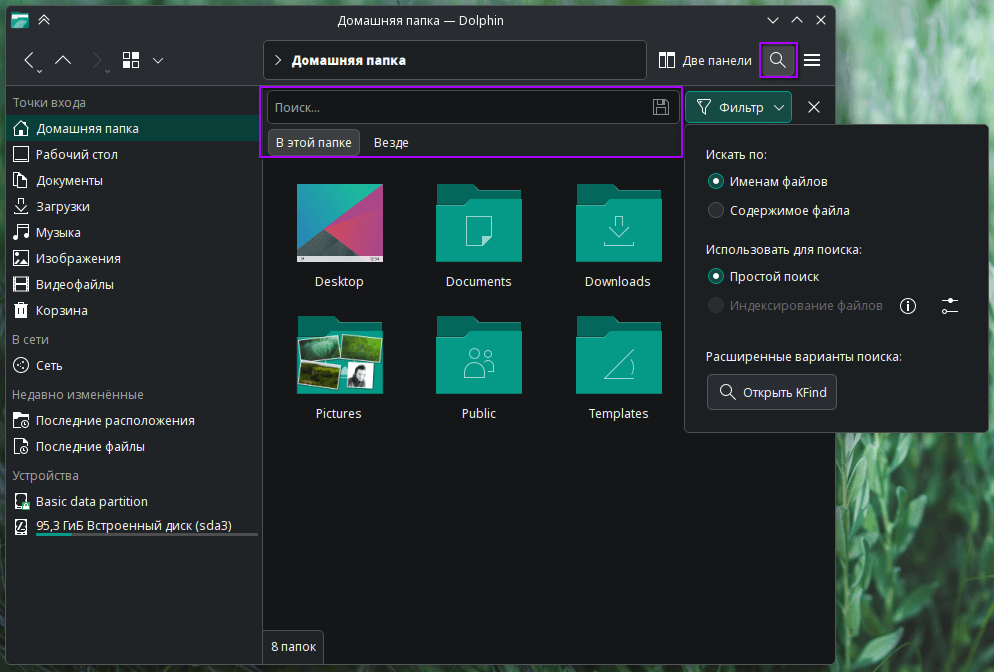

## Подключение внешних устройств и сетевых ресурсов

### Внешние носители

Флешки, внешние диски:

* Автоматически отображаются в боковой панели
* Монтируются по клику
* Перед извлечением используйте «Безопасно извлечь»

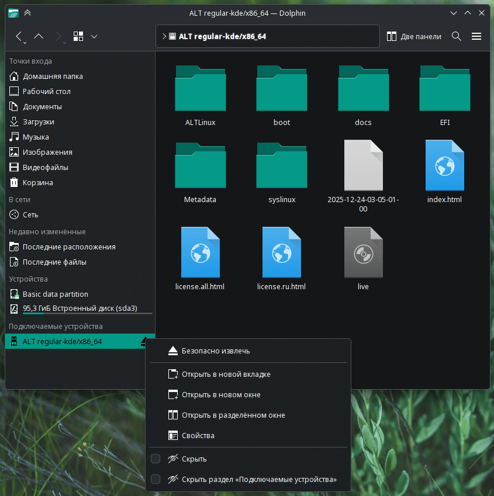

### Сетевые ресурсы

Dolphin поддерживает:

* SMB/CIFS (Windows-сети)
* FTP, SFTP
* WebDAV

Доступ осуществляется через:

* Боковую панель → Сеть
* Или ввод адреса вида:

  ```
  smb://server/share
  ```

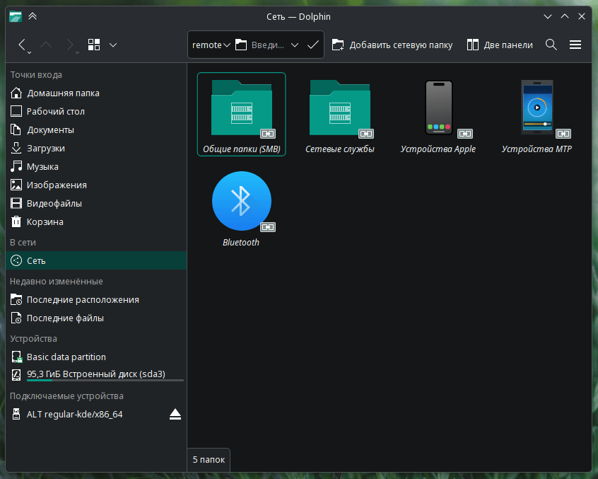

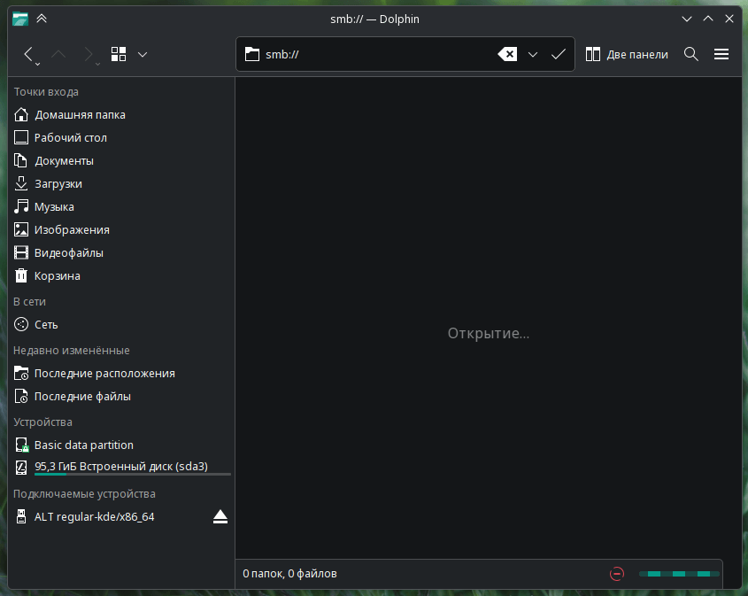

## Свойства файлов и права доступа

Через **Правый клик → Свойства** можно:

* Посмотреть размер и тип файла
* Изменить имя
* Настроить права доступа (чтение, запись, выполнение)
* Изменить владельца (при наличии прав)

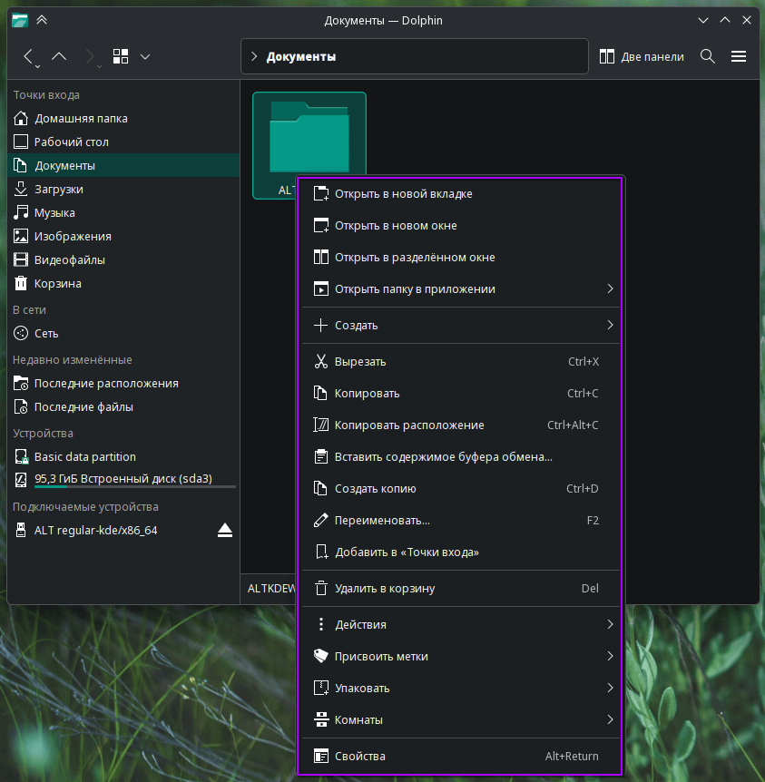

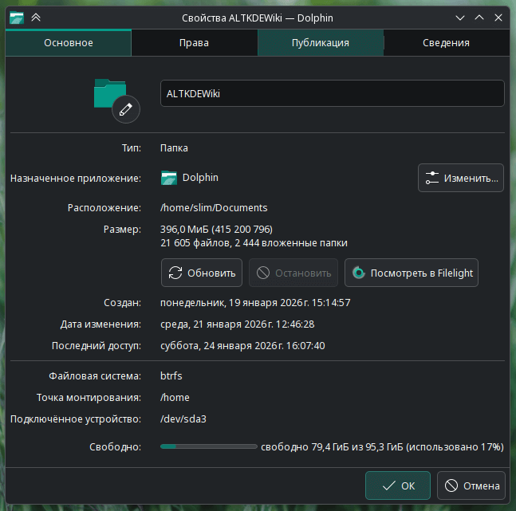

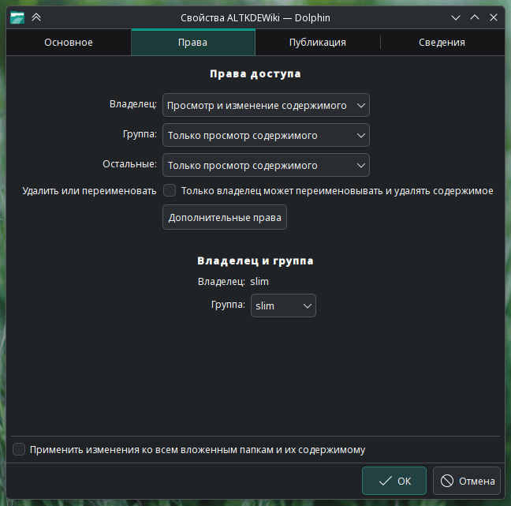

Это особенно важно для пользователей Linux, ранее не сталкивавшихся с системой прав доступа.

## Заключение

Dolphin — мощный и гибкий файловый менеджер, который подходит как для повседневных задач, так и для более сложных сценариев. Новым пользователям KDE Plasma рекомендуется:

* Освоить навигацию и контекстное меню
* Использовать вкладки и разделение окна
* Постепенно знакомиться с расширенными возможностями

Даже базового освоения Dolphin достаточно, чтобы эффективно работать с файлами в Linux-системах на базе KDE.
