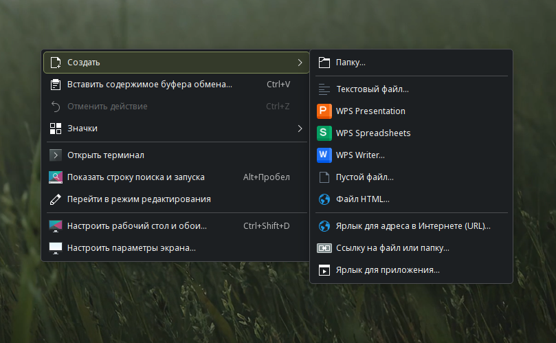
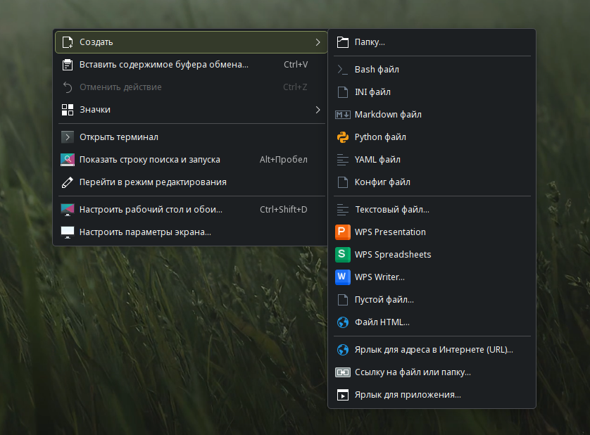

# Настройка меню «Создать» в Dolphin

В файловом менеджере Dolphin уже присутствует множество встроенных шаблонов для создания файлов. По умолчанию доступны:

- Папки
- Текстовые файлы
- Пустые файлы
- HTML-файлы
- Ярлыки и ссылки

Однако вы можете добавить собственные шаблоны для других типов файлов.



## Добавление шаблонов через терминал

Выполните нужные команды в терминале (Konsole). Если какой-то шаблон вам не нужен, просто пропустите соответствующую команду.

### Bash-скрипт

```shell
touch $(xdg-user-dir TEMPLATES)/Bash\ файл.sh
echo "#\!/bin/bash" > $(xdg-user-dir TEMPLATES)/Bash\ файл.sh
```

Создаёт bash-скрипт с шебангом `#!/bin/bash`.

### Python-скрипт

```shell
touch $(xdg-user-dir TEMPLATES)/Python\ файл.py
echo "#\!/usr/bin/env python3" > $(xdg-user-dir TEMPLATES)/Python\ файл.py
```

Создаёт Python-скрипт с шебангом для Python 3.

### Markdown-документ

```shell
touch $(xdg-user-dir TEMPLATES)/Markdown\ файл.md
echo "# Заголовок" > $(xdg-user-dir TEMPLATES)/Markdown\ файл.md
```

Создаёт Markdown-файл с заголовком первого уровня.

### Конфигурационные файлы

```shell
touch $(xdg-user-dir TEMPLATES)/Конфиг\ файл.conf
touch $(xdg-user-dir TEMPLATES)/INI\ файл.ini
touch $(xdg-user-dir TEMPLATES)/YAML\ файл.yaml
```

Создаёт пустые конфигурационные файлы различных форматов.

## Добавление собственных шаблонов

Для добавления любых других шаблонов используйте простой способ:

1. Создайте нужные файлы с желаемым содержимым
2. Скопируйте их с помощью Dolphin в папку **Шаблоны** (Templates)

**Путь к папке**: **Домашняя папка** → **Шаблоны**

После добавления файлов в папку Шаблоны они автоматически появятся в контекстном меню **Создать** без необходимости перезапуска Dolphin.


