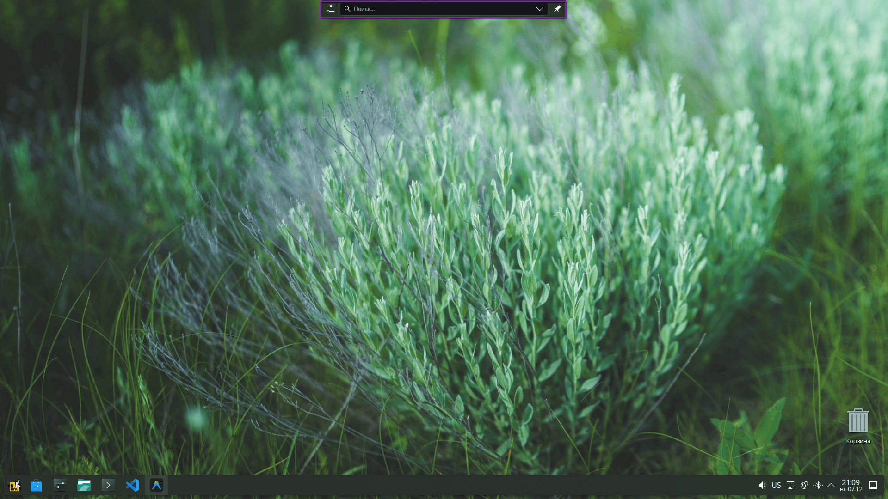
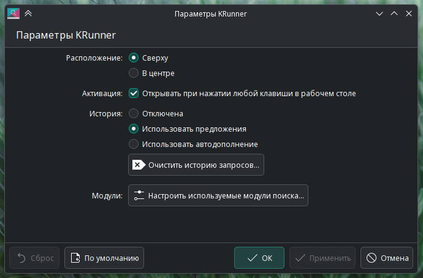
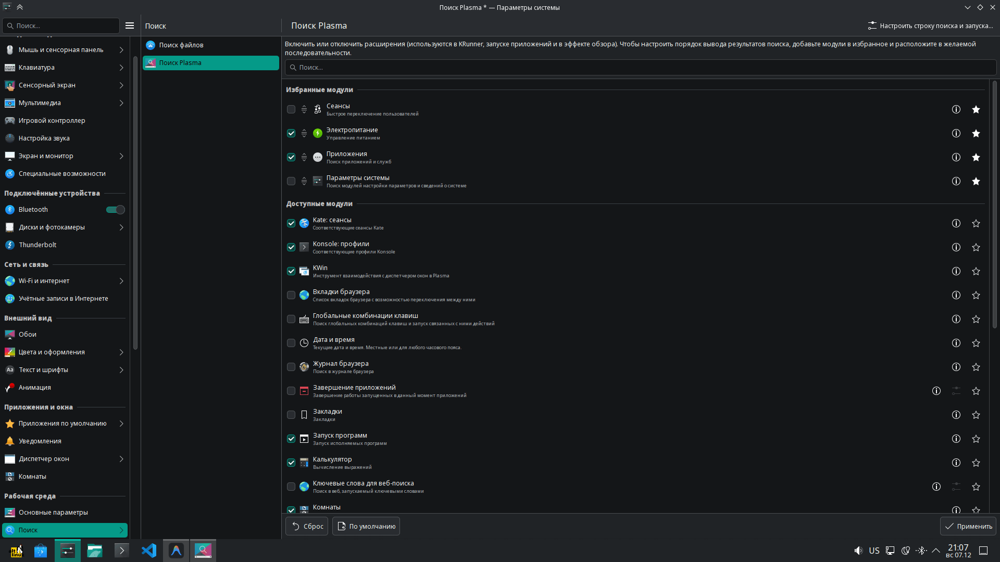
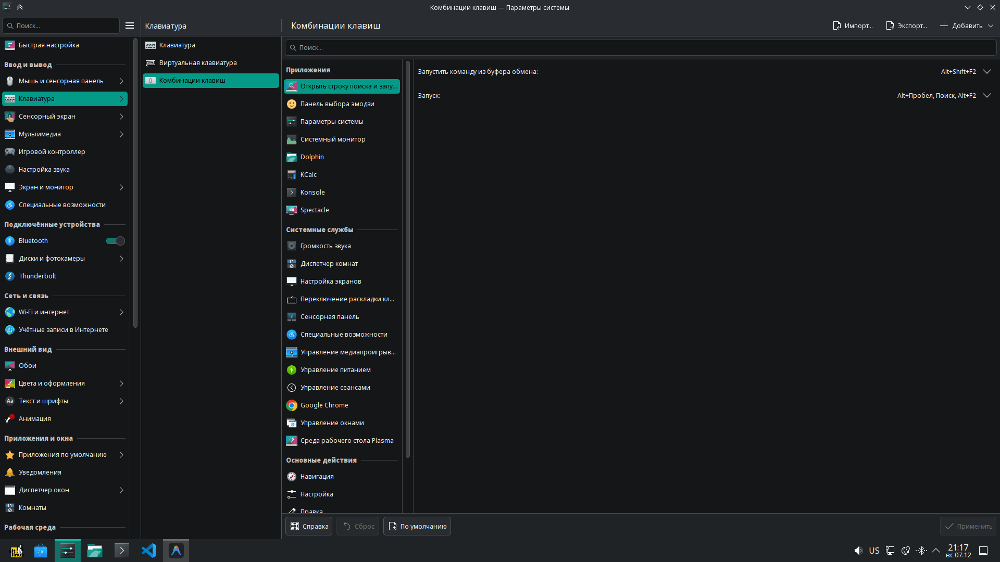

# KRunner в KDE Plasma 6

**KRunner** — это мощный инструмент для запуска приложений, поиска файлов, выполнения команд и многого другого в среде рабочего стола KDE Plasma. В Plasma 6 он стал ещё умнее и быстрее.

## Запуск KRunner

По умолчанию KRunner запускается сочетанием клавиш `Alt` + `Space` (или `Alt` + `F2`).
Также вы можете начать печатать на пустом рабочем столе, и KRunner откроется автоматически.

  

## Основные возможности

### 1. Запуск приложений
Просто начните вводить название приложения.
*   **Новое в Plasma 6**: Улучшенный "умный" поиск (fuzzy matching). Теперь KRunner лучше понимает опечатки и находит программы, даже если вы ввели название не совсем точно.

### 2. Поиск файлов
KRunner умеет искать файлы и папки на вашем компьютере. Он также может искать по содержимому файлов, если включена индексация Baloo.

### 3. Калькулятор и конвертер
Вы можете использовать KRunner для быстрых вычислений.
*   Введите `26 * 45` или `sqrt(64)`, чтобы получить результат.
*   Конвертируйте валюты и единицы измерения: `100 USD to EUR` или `50 miles to km`.

### 4. Управление системой
KRunner позволяет управлять питанием и сеансами:
*   Введите `Выключить`, `Перезагрузить` или `Сон` для управления питанием.
*   Введите `Яркость` для регулировки яркости экрана.

### 5. Веб-сокращения
Используйте веб-сокращения для быстрого поиска в интернете:
*   `gg:KDE` — поиск "KDE" в Google.
*   `wp:KRunner` — поиск статьи о KRunner в Википедии.

## Новые функции в Plasma 6

### Поиск глобальных горячих клавиш
В Plasma 6.5 появилась возможность искать глобальные клавиатурные сокращения прямо в KRunner. Это отличный способ узнать или вспомнить сочетание клавиш для конкретного действия.

### Визуализация цветов
Введите шестнадцатеричный код цвета (например, `#ff0000`) или его название (например, `MintCream`), и KRunner покажет вам этот цвет.

### Мгновенные результаты
Большинство плагинов KRunner теперь выдают результаты мгновенно, сразу после ввода первого символа.

## Настройка KRunner

Чтобы открыть настройки KRunner, нажмите на иконку настроек в левой части строки поиска.

### Плагины (Раннеры)
KRunner использует модульную систему "раннеров" (плагинов) для выполнения различных задач. В настройках вы можете:
*   **Включать и отключать плагины**: Уберите галочки с тех функций, которыми вы не пользуетесь, чтобы ускорить поиск и убрать лишние результаты.
*   **Настраивать отдельные плагины**. Некоторые раннеры имеют собственные настройки (кнопка справа от названия). Например, в плагине "Поиск файлов" можно исключить определённые папки.

### Позиционирование
Вы можете выбрать, где будет появляться окно KRunner:
*   **Сверху экрана** (по умолчанию).
*   **По центру экрана**: KRunner будет выглядеть как всплывающая панель по центру экрана.

### История поиска
KRunner запоминает ваши предыдущие запросы.
*   Нажмите клавишу `Вниз` в пустой строке поиска, чтобы увидеть историю.
*   В настройках можно очистить историю или отключить её сохранение для повышения приватности.

### Горячие клавиши
Если вы хотите изменить сочетание клавиш для запуска KRunner (по умолчанию `Alt+Space` и/или `Alt+F2`):
1.  Откройте **Параметры системы**.
2.  Перейдите в раздел **Клавиатура** -> **Комбинации клавиш**.
3.  Введите в строку поиска **KRunner** или найдите пункт **Открыть строку поиска и запуска...** и задайте удобную вам комбинацию.

