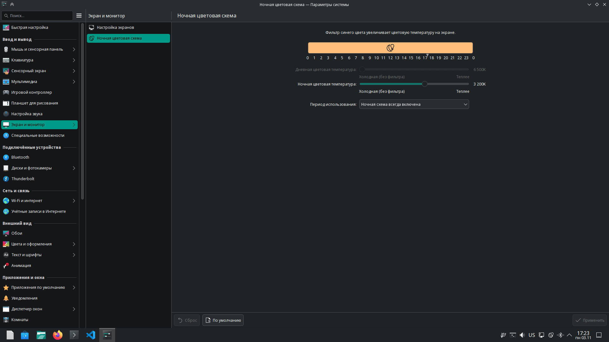
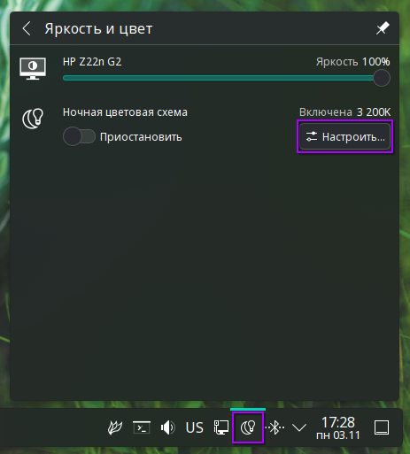
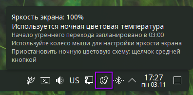
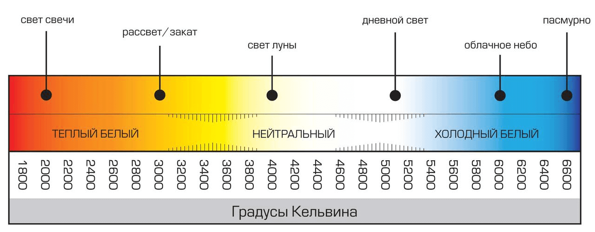
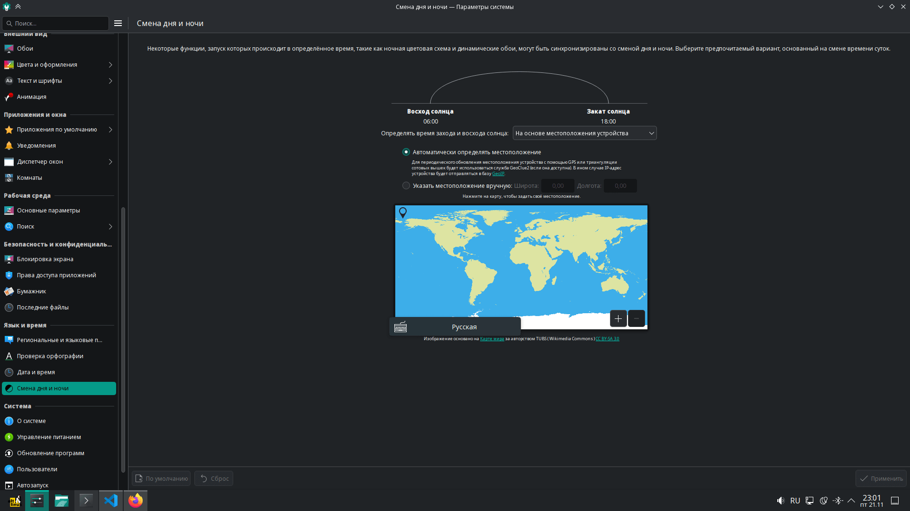
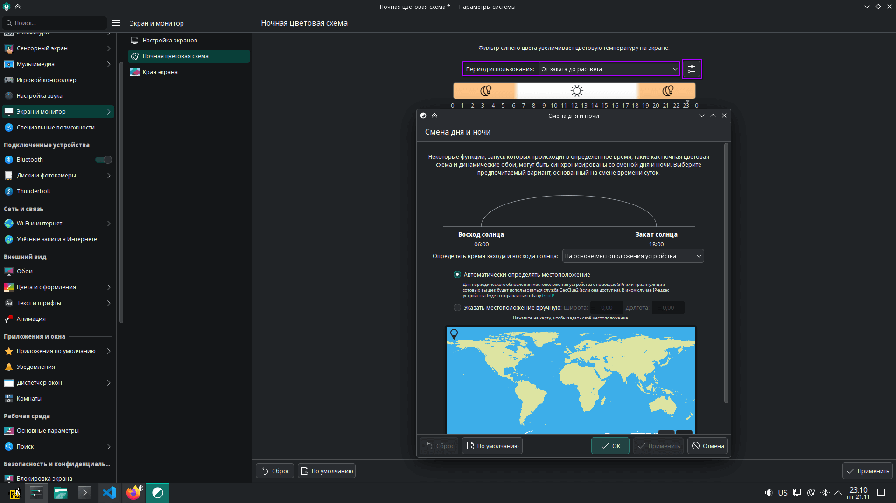
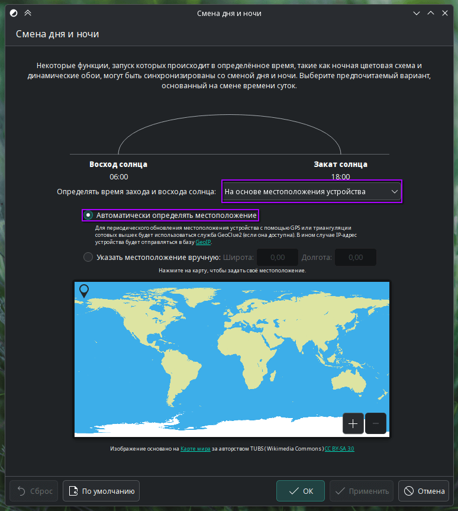
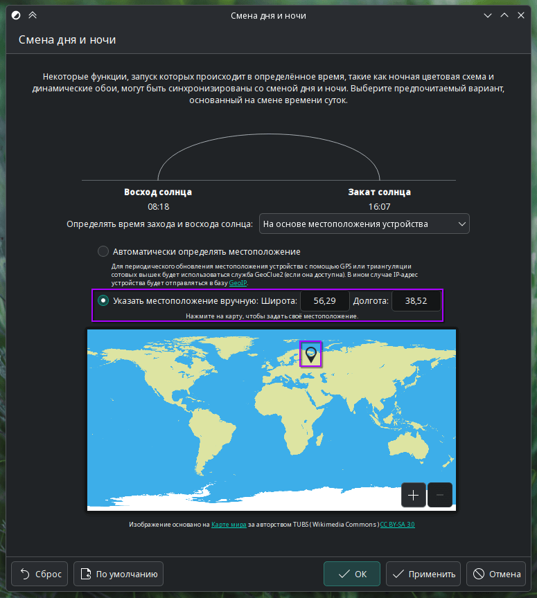
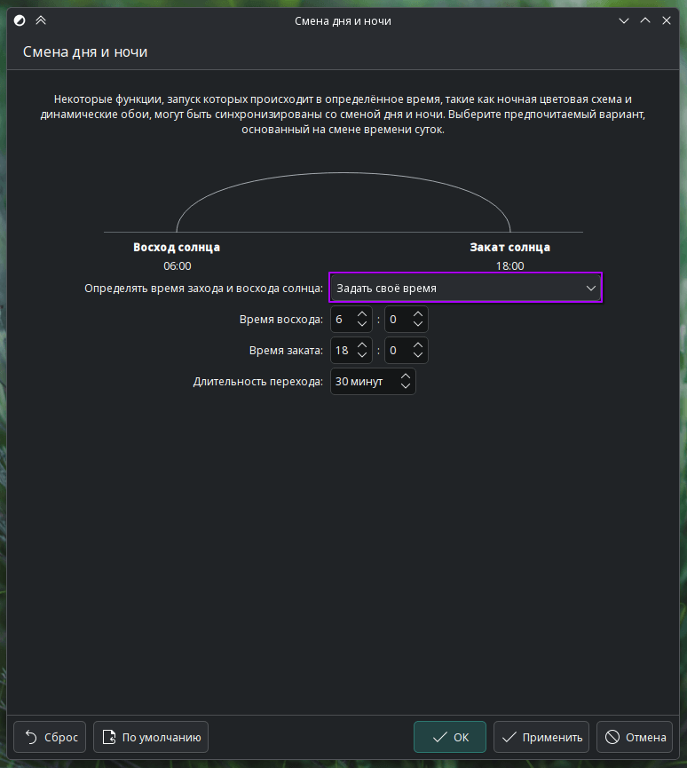
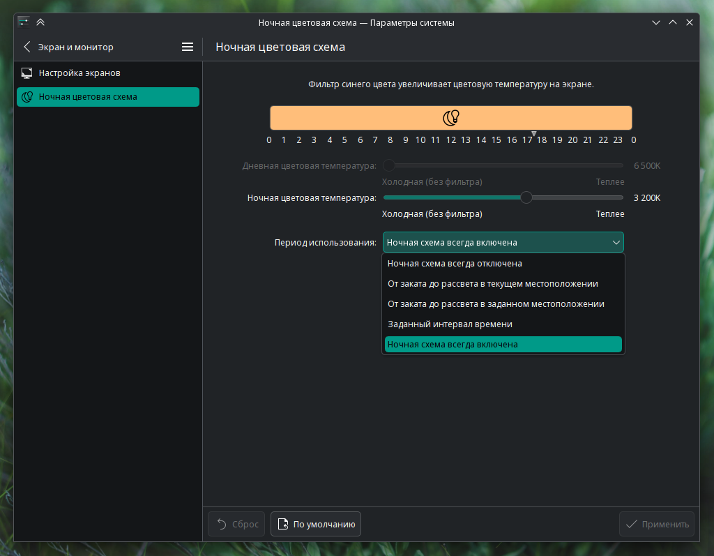

# Настройка ночной цветовой схемы (Night Light) в KDE Plasma 6

Night Light — это встроенная функция KDE Plasma, которая уменьшает количество синего света, излучаемого экраном, особенно в вечернее и ночное время. Это помогает снизить утомляемость глаз и улучшить качество сна.

В KDE Plasma 6 функциональность Night Light была значительно улучшена: добавлено графическое представление активных периодов, улучшена точность цветопередачи и интеграция с системой управления питанием и цветовым профилем .

## Доступ к настройкам ночной цветовой схемы

Настроить ночную цветовую схему в KDE Plasma 6 можно:

### Через Параметры системы

1. Откройте **Параметры системы** (`System Settings`).
2. Перейдите в раздел **Экран и монитор** → **Ночная цветовая схема**.
3. В открывшемся окне вы увидите основные параметры управления фильтром синего света.

### Через системный лоток

Самый быстрый способ включить или отключить Night Light — воспользоваться виджетом в панели задач:

1. Найдите в правой части панели задач значок **Night Light** (иконка с полумесяцем, солнцем за горизонтом или лампочкой).
2. Нажмите на него, чтобы **открыть меню управления** яркостью и цветом.
3. При наведении может отображаться текущий статус: _«Night Light включён»_ или _«Night Light выключен»_.

:::tip
Если значок не отображается, убедитесь, что модуль **Night Light** включён в настройках панели:  
**Правый клик по панели → Добавить или изменить Виджеты → Добавить виджет Яркость и цвет**.
:::

## Температура цвета

- **Дневная температура**: цветовая температура дисплея в дневное время (обычно около 6500 K).
- **Температура ночного света**: насколько тёплым будет экран ночью (меньше значение — теплее изображение, например, 3000–4000 K).

  

## Планирование работы

KDE Plasma 6 поддерживает несколько режимов планирования:

- **Постоянно включён/выключен**: Night Light работает круглосуточно с заданной температурой.
- **Циклы день/ночь**: автоматическое включение/выключение в зависимости от времени суток.

### В версии KDE Plasma 6.5

в разделе Параметры системы (`System Settings`) добавлен новый пункт меню: **Смена дня и ночи**.

Графический интерфейс отображает активные и неактивные периоды на удобной временной шкале, что значительно упрощает настройку и визуальный контроль расписания.

Перейти к настройкам **Смена дня и ночи** можно и прямо из настроек Ночной цветовой схемы, предварительно выбрав **Период использования: От заката до рассвета** и кликнув по кнопке настроек:

По умолчанию время рассвета и заката определяется автоматически на основе вашего текущего местоположения.

Вы также можете задать местоположение вручную:
— выберите опцию **Указать место вручную** и введите геоданные (широту и долготу) вручную,
— или кликните на интерактивной карте, чтобы выбрать нужную точку — система автоматически заполнит поля геоданных и активирует соответствующий режим.

Интерактивная карта обеспечивает интуитивный и точный выбор местоположения без необходимости ввода координат вручную.

Для более тонкой настройки времени выберите **Задать свое время**

### В более ранних версиях KDE Plasma 6

в режиме цикла вы можете указать:

- Фиксированное время включения и выключения;
- Или использовать геолокацию для автоматического определения восхода и заката.

## Известные особенности и советы

- Убедитесь, что у вас включена поддержка цветового профилирования, особенно если вы используете HDR — начиная с Plasma 6.3, Night Light корректно взаимодействует с цветовыми профилями без искажений .
- Если Night Light не отключается днём при использовании автоматического графика, проверьте настройки времени и геопозиции — иногда баг может приводить к постоянному применению ночной температуры .

## Заключение

Night Light в KDE Plasma 6 — это мощный и гибкий инструмент для защиты зрения, особенно при длительной работе за компьютером в тёмное время суток. Благодаря улучшениям в новых версиях, его стало проще настраивать и использовать.
