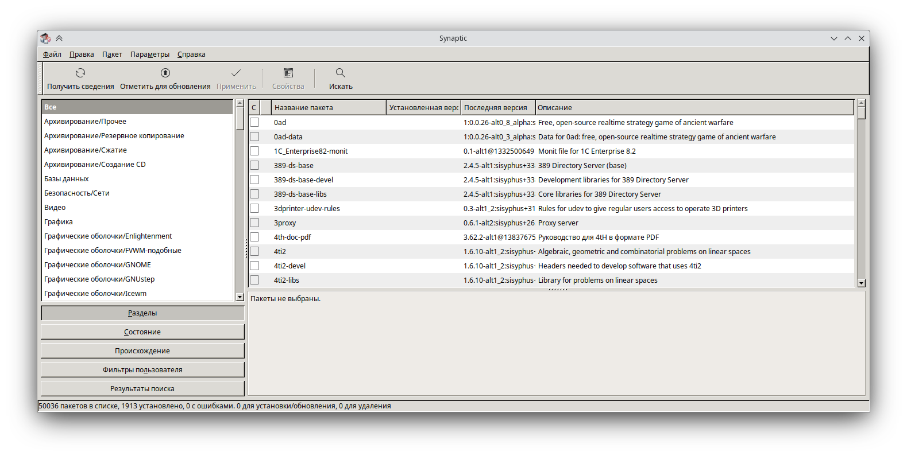
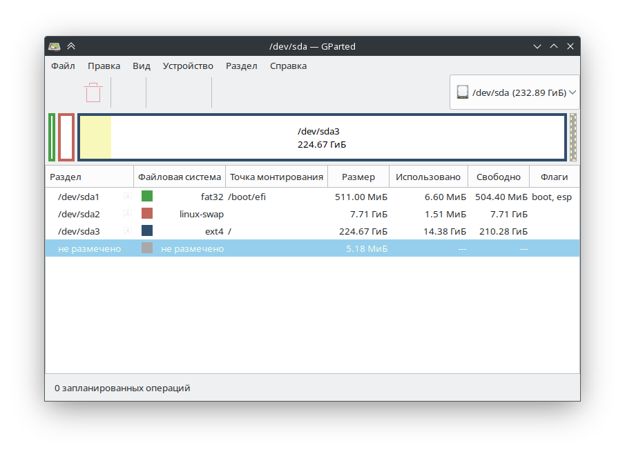
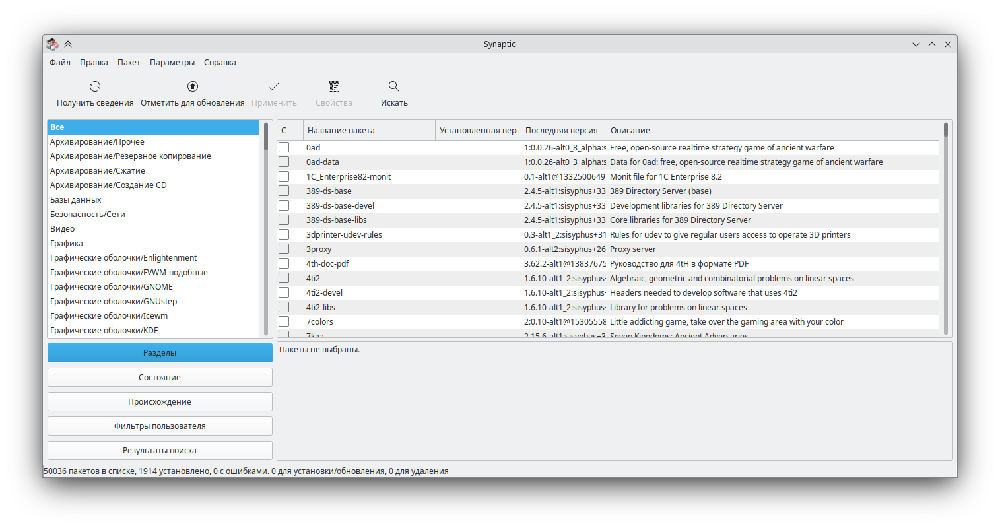

# Некоторые GTK приложения  выглядят чужеродно

Некоторые GTK приложения используют тему «Default», которая имеет внешний вид в стиле «Windows 95».
Она совершенно не сочетается с современным дизайном KDE, но, к счастью, это легко исправить.

Ниже вы можете наблюдать вышеописанную проблему на примере приложения «Synaptic»:



Однако на сегодняшний день в основном вы будете встречаться с ситуацией, когда внешний вид схож с KDE, но при этом он не полноценный.
Например, будут отсутствовать некоторые иконки у кнопок и/или не будет использоваться темная тема, если вам таковая нужна.

На скриншоте ниже можно наблюдать именно этот случай на примере программы «Gparted»:


### Установка правильной темы
1. Заходим в приложение «Параметры системы KDE5»
2. Переходим во вкладку «Внешний вид» и выбираем пункт «Оформление приложений»
3. Нажимаем на кнопку «Настроить оформление приложений GNOME/GTK», которая находится в правом нижнем углу
4. Выбираем подходящую тему:
   - Breeze-Education — Светлая тема
   - Breeze-Education-dark — Темная тема

   P.S: Если у вас отсутствуют данные темы, то вам необходимо установить их вручную при помощи команды ниже:
   :::tabs
   == apt-get
   ```shell
   su -
   apt-get install gtk-theme-breeze-education
   ```

   == epm
   ```shell
   epm -i gtk-theme-breeze-education
   ```
   :::
5. Нажимаем «Применить»

Теперь подобные приложения должны использовать корректную тему:


