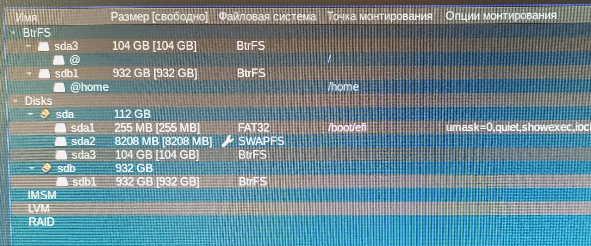

# Восстанавливаем GRUB на Btrfs

::: info
Данная инструкция актуальна для случаев, когда используется файловая система Btrfs, запись GRUB повреждена или удалена, но сама система цела.
:::

## Подготовка к восстановлению

Рассмотрим процесс восстановления GRUB на примере. Тестовый стенд и его разметка:

- `sda` - SSD на 120GB. На нем размещены `boot`, `swap` и основная система.
- `sdb` - HDD на 1000GB. Используется только для `home`.



## Вход в режим восстановления GRUB

В случае наличия повреждённой записи GRUB мы увидим следующее приветствие:

```shell
GNU GRUB version...
Minimal BASH-like line editing...
grub>
```

Теперь наша задача — войти в систему. Для этого нам потребуется сначала найти директорию `boot` в корневом разделе. В GRUB свои обозначения разделов. Выведем список разделов командой `ls`:

```
(proc) (hd0,gpt2) (hd0,gpt1) (hd1) (hd1,gpt3), (hd1,gpt2), (hd1,gpt1) (hd2) (hd2,gpt1)
```

## Поиск корневого раздела

Для того, чтобы разобраться, что чем является в нашей файловой системе, в GRUB можно подсмотреть содержимое разделов, используя команду вида `ls (hd#,gpt*)/`, где `#` - номер диска, `*` - номер раздела.

### Примеры поиска разделов

`ls (hd0,gpt2)/`

```
grub/ ventoy/ efi/ ENROLL_THIS_KEY_IN_MOKMANAGER.cer tool/
```

Очевидно, мы нашли вставленный в компьютер USB-носитель с Ventoy. Значит, диск `hd0` нас больше не интересует.

`ls (hd2,gpt1)/`

```
@home/
```

Мы нашли раздел нашего HDD-диска, на котором размещён раздел `/home`. Значит, диск `hd2` нас больше не интересует.

`ls (hd1,gpt1)/`

```
efi/
```

Судя по ответу, мы нашли раздел `sda1` (смотрим разметку в начале статьи). Но он нам сейчас не нужен.

`ls (hd1,gpt2)/`

```
error: unknown filesystem.
```

Здесь мы нашли swap-раздел.

`ls (hd1,gpt3)/`

```
@/
```

Мы нашли корневой раздел в Btrfs. Просмотрим содержимое файловой системы, перейдя чуть глубже:

`ls (hd1,gpt3)/@/`

```
dev/ run/ selinux/ boot/ lib/ sbin/ ...
```

Теперь нам видна структура корневого раздела, в котором также присутствует директория `/boot`.

## Загрузка системы через GRUB

Теперь наша задача — найти и указать GRUB путь к образу ядра Linux, путь к корневому разделу (мы уже знаем, что это будет `root=/dev/sda3`) и путь к образу Initrd. Для этого ещё углубимся в файловую систему:

`ls (hd1,gpt3)/@/boot/`

```
System.map-6.1.57-un-def-alt1 initrd-un-def.img initrd.img vmlinuz
initrd-6.1.57-un-def-alt1.img grub/ vmlinuz-6.1.57-un-def-alt1 vmlinuz-un-def
splash/ memtest-6.20.bin config-6.1.57-un-def-alt1 efi/ memtest-6.20.efi
```

Здесь мы нашли искомое и в следующих командах сможем точь-в-точь переписать пути к образу ядра (`vmlinuz-6.1.57-un-def-alt1`) и к образу initrd (`initrd-6.1.57-un-def-alt1.img`).

Выполним команды загрузки:

```
linux (hd1,gpt3)/@/boot/vmlinuz-6.1.57-un-def-alt1 root=/dev/sda3
initrd (hd1,gpt3)/@/boot/initrd-6.1.57-un-def-alt1.img
boot
```

После выполнения последней команды система начнёт загружаться и мы сможем войти в неё.

## Установка GRUB в систему

Войдя в систему, мы увидим, что в Параметрах системы KDE → Рабочая среда → Запуск и завершение → Загрузчик GRUB2 записей нет. Это говорит о том, что мы вошли в систему, но конфигурация GRUB автоматически не записалась. То есть если ничего не изменить, то при следующей перезагрузке мы снова попадём в GRUB.

::: warning
Не выполнение следующих действий приведет к необходимости повторного ручного восстановления при каждой перезагрузке!
:::

Для исправления ситуации установим GRUB:

::: code-group

```shell[apt-get]
su -
apt-get install grub
```

```shell[epm]
epm -i grub
```

:::
После установки GRUB он автоматически создаст и сохранит конфигурацию. Увидеть это можно будет, вновь зайдя в Параметрах системы KDE → Рабочая среда → Запуск и завершение → Загрузчик GRUB2.

На этом восстановление повреждённой записи GRUB будет завершено.
