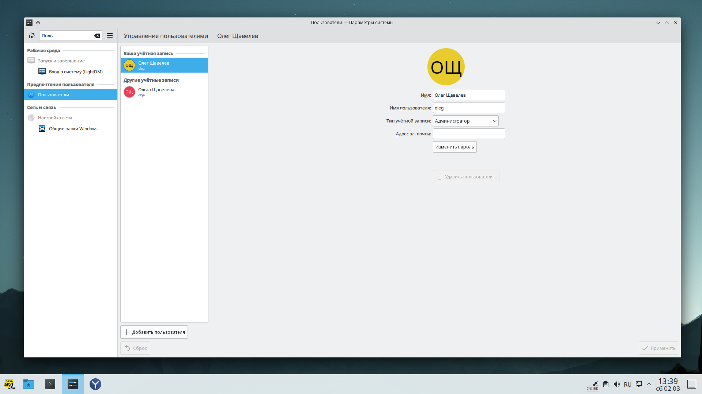

# Отсутствует список пользователей в настройках

В настройках системы отсутствует список пользователей:


## Добавить список пользователей в настройки (обходное решение)

Для отображения списка используя терминал установите пакет `accountsservice`:

::: code-group

```shell[apt-get]
su -
apt-get update
apt-get install accountsservice
```

```shell[epm]
epm -i accountsservice
```

:::

Теперь перезайдите в параметры системы для вступления изменений в силу.


